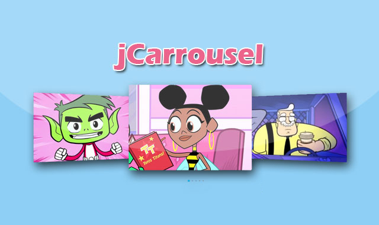

## 前言

在前端开发的历史长河中，有一个名字家喻户晓，那就是 JavaScript。今天，我们要回到互联网的远古时代，揭开 JavaScript 的神秘面纱，看看它是如何从一个简单的脚本语言，变成今天不可或缺的存在的。

## 刀耕火种 

### JavaScript 的起源和早期发展

#### JavaScript 的诞生

在 1995 年的某个春天，互联网的世界还很简陋，网页就像是数字报纸，只能显示静态内容。Netscape 公司的布兰登·艾奇（Brendan Eich）觉得：嘿，能不能给网页加点互动呢？于是，JavaScript 就这样诞生了。

> **示意图：布兰登·艾奇和 JavaScript 的诞生**
> 
> *图 1：布兰登·艾奇，JavaScript 的创造者*

布兰登·艾奇只用了10天，就创造了 JavaScript。要知道，很多程序员修一个 Bug 都要10天！这种效率，堪称编程界的奇迹。

#### 最初的用途和局限

最初，JavaScript 被称为 Mocha，然后改名为 LiveScript，最后才定名为 JavaScript。这名字听起来高大上，但其实它和 Java 语言几乎没有关系，只是为了蹭 Java 的热度而已。早期的 JavaScript 功能很简单，大概只能做一些表单验证、弹个对话框啥的。

> **示意图：早期的网页互动**
> 
> *图 2：早期的 JavaScript 互动效果*

当时的 JavaScript，简直是“程序员的噩梦”：没有模块系统，没有类，甚至连 `let` 和 `const` 这种声明变量的方法都没有。写 JavaScript 的感觉，就像是拿着锤子在修手表。

#### 早期浏览器的支持情况

当 JavaScript 出现后，浏览器界也不甘示弱。Netscape 率先在自家浏览器中支持了 JavaScript。而微软则推出了 JScript（没错，他们还改了个名字），并在 Internet Explorer 中支持。

> **示意图：早期浏览器大战**
> 
> *图 3：Netscape 与 Internet Explorer 的浏览器大战*

这段时间，浏览器之间的兼容性问题让开发者们欲哭无泪。同一段代码，在 Netscape 上能跑，到了 IE 上就可能直接跪了。开发者们每天都在浏览器之间切换，修复各种稀奇古怪的 Bug，感觉就像在玩浏览器版的俄罗斯方块。

## 万物归一

### jQuery 的崛起

在前端开发的进化史上，有一个时期可以称之为“万物归一”。这段时间，jQuery 横空出世，成为了前端开发的救世主。它不仅简化了 JavaScript 的编写，还为开发者们带来了前所未有的便利。今天，让我们一起来回顾一下 jQuery 的崛起，看看它是如何在混乱的前端世界中一统江湖的。

2006 年，约翰·瑞西格（John Resig）发布了 jQuery。这位程序员当时一定是灵光乍现，觉得不能再让大家在 DOM 操作的泥沼中挣扎了。于是，他创造了 jQuery，一个让大家可以“写得更少，做得更多”的库。没错，jQuery 的口号就是这么自信。

> **示意图：jQuery 的崛起**
> 
> *图 4：jQuery 标志*

#### jQuery 的神奇魅力

jQuery 的魅力在于其简单易用。以往，我们要操作 DOM，代码可能像一篇小作文。但有了 jQuery，一切变得如此简单。比如，我们要隐藏一个元素，从前可能要写一大堆代码，但现在只需一行：

```javascript
$("#myElement").hide();
```

这样简洁的代码，简直是对程序员的最大恩赐。更别提 jQuery 那强大的选择器系统，让你感觉自己像是在用 CSS 而不是写 JavaScript。

#### jQuery 插件生态系统

不仅如此，jQuery 还有一个庞大的插件生态系统。无论你想实现什么功能，总能找到一个现成的 jQuery 插件。想做个幻灯片？没问题，用 `slick` 插件。想要复杂的表单验证？`jQuery Validate` 来帮你搞定。可以说，jQuery 的插件让前端开发者感觉自己仿佛拥有了魔法棒，轻轻一点，就能实现各种酷炫效果。

> **示意图：使用 jQuery 插件**
> 
> *图 5：使用 jQuery 插件的效果*

#### jQuery 的巅峰时刻

在 2010 年代初期，jQuery 几乎统治了整个前端开发领域。根据统计数据，超过 70% 的网站都在使用 jQuery。那时候，如果你不懂 jQuery，几乎就无法生存于前端开发的江湖。开发者们日夜苦练 jQuery，掌握了这门技能，就好像拿到了前端开发的通行证。

#### jQuery 的挑战

然而，天下没有不散的筵席。随着时间的推移，前端开发技术不断进步，新的框架如雨后春笋般冒出。React、Vue、Angular 等现代框架的出现，让开发者们有了更多选择。jQuery 的地位开始受到挑战，特别是在大型应用和组件化开发方面，jQuery 显得有些力不从心。

#### jQuery 的遗产

尽管如此，jQuery 的影响力不可否认。它让前端开发变得更加简单和高效，为现代前端框架的出现铺平了道路。即便在今天，jQuery 仍然在许多项目中扮演重要角色，特别是在那些维护性项目和简单网站中。

jQuery 的崛起和辉煌，就像一部前端开发的传奇剧。它不仅改变了无数开发者的工作方式，还推动了整个前端技术的发展。虽然今天的前端世界百花齐放，但 jQuery 的精神永远存在，它让我们记住了那段“万物归一”的美好时光。

## 百家争鸣

### Angular.js、React 和 Vue 的发展

在前端开发的历史中，有一个时期可以被称为“百家争鸣”。这段时间，各大框架如雨后春笋般冒出，各显神通。在这场激烈的竞争中，Angular.js、React 和 Vue 成为了最具代表性的三大框架。今天，我们就来看看它们是如何在前端世界中争奇斗艳的。

#### Angular.js：全能型选手的起伏

Angular.js 由 Google 在 2010 年推出，是一个全能型的前端框架。Angular.js 的目标是解决单页应用开发中的痛点，通过提供 MVC 架构，使开发者可以更容易地构建复杂的应用。

> **示意图：Angular.js 标志**
> 
> *图 6：Angular.js 标志*

Angular.js 以其双向数据绑定、依赖注入和强大的指令系统迅速赢得了开发者的青睐。双向数据绑定让数据和视图的同步变得前所未有的简单，简直就是开发者的“福音”。

```javascript
// Angular.js 的双向数据绑定示例
<input ng-model="name">
<p>Hello, {{name}}!</p>
```

然而，Angular.js 的学习曲线陡峭，复杂的概念和语法让不少新手开发者望而却步。Google 也意识到这个问题，于是在 2016 年推出了完全重写的 Angular（也称为 Angular 2 及后续版本），试图解决这些问题。然而，Angular.js 和新 Angular 之间的巨大差异，让不少开发者感到困惑和不满。

#### React：组件化和单向数据流的革新

2013 年，Facebook 发布了 React，一个革命性的前端库。与 Angular.js 不同，React 并不试图成为一个全能框架，而是专注于视图层，通过组件化的方式，使 UI 的构建变得模块化和可复用。

> **示意图：React 标志**
> 
> *图 7：React 标志*

React 的核心理念是组件化和单向数据流。组件化让开发者可以将 UI 拆分为独立的小组件，每个组件都有自己的状态和逻辑。单向数据流则通过明确的数据流向，降低了应用的复杂性和调试难度。

```javascript
// 一个简单的 React 组件
class HelloWorld extends React.Component {
  render() {
    return <h1>Hello, world!</h1>;
  }
}
```

React 的虚拟 DOM 技术，让页面的更新变得高效而流畅。每次状态改变时，React 会计算出最小的 DOM 变更，然后批量更新，这大大提高了性能。

#### Vue：渐进式框架的崛起

2014 年，尤雨溪（Evan You）发布了 Vue，一个渐进式前端框架。Vue 的设计理念是渐进式，即开发者可以根据需求逐步引入 Vue 的功能，从简单的视图层库，到复杂的单页应用框架，Vue 都能轻松应对。

> **示意图：Vue 标志**
> 
> *图 8：Vue 标志*

Vue 的语法简单易学，类似于 HTML 和 JavaScript 的结合，非常适合新手上手。同时，Vue 也借鉴了 Angular.js 和 React 的优点，提供了数据绑定和组件化的能力。

```javascript
// 一个简单的 Vue 组件
const app = new Vue({
  el: '#app',
  data: {
    message: 'Hello, Vue!'
  }
});
```

Vue 的生态系统也非常完善，从路由管理（Vue Router）到状态管理（Vuex），都有完整的解决方案。其灵活性和易用性，使得 Vue 在短时间内迅速流行，成为前端开发的新宠。

### Angular.js、React 和 Vue 的竞相辉煌

在前端开发的历史中，Angular.js、React 和 Vue 各自发挥了重要的作用。它们的出现，让前端开发变得更加高效和灵活，推动了整个行业的发展。尽管它们各有优劣，但正是这种百家争鸣的局面，激发了更多的创新和进步。

## 未来展望：前端开发的无限可能

前端开发的世界总是充满了惊喜和创新。从刀耕火种的 JavaScript，到万物归一的 jQuery，再到百家争鸣的 Angular、React 和 Vue，每一阶段都有其独特的魅力。那么，未来的前端开发又会走向何方呢？让我们展开想象的翅膀，幽默风趣地展望一下未来的前端开发吧！

#### 微前端：大型项目的救星

微前端的概念就像是前端世界的“分而治之”，它将一个大型的单页应用分解为多个小型的前端应用，每个应用由不同的团队独立开发和部署。这不仅提高了开发效率，还解决了大型项目中的维护和扩展问题。

> **示意图：微前端架构**
> 
> *图 9：微前端架构*

想象一下，每个微前端应用就像是一个独立的小岛，开发者们就像是岛上的居民。他们只需要关心自己岛上的建设，而不需要操心其他岛上的事情。这种方式不仅让开发变得更加高效，还能有效地避免“交通堵塞”和“资源争夺”的问题。

#### 无服务器架构：前端开发的新大陆

无服务器架构（Serverless）听起来就像是一个程序员的梦想：无需管理服务器，只需编写代码，剩下的交给云服务提供商。无服务器架构让前端开发者可以专注于前端逻辑，而不需要关心后端的运维问题。

> **示意图：无服务器架构**
> 
> *图 10：无服务器架构*

无服务器架构的出现，让开发者们可以像在“前端乐园”中尽情玩耍。只需写几行代码，就能实现复杂的后端功能，比如处理用户请求、存储数据和发送通知。而所有这些，只需要在云端点几下鼠标，就能搞定。

#### WebAssembly：前端性能的革命

WebAssembly（Wasm）是一种新的二进制指令格式，可以在浏览器中高效运行。它允许开发者使用包括 C++、Rust 等多种语言编写代码，并将其编译为 Wasm，在浏览器中执行。WebAssembly 的出现，进一步提升了 Web 应用的性能和可能性。

> **示意图：WebAssembly 标志**
> 
> *图 11：WebAssembly 标志*

WebAssembly 就像是前端开发的“超能战士”，它的出现让前端应用的性能达到了前所未有的高度。无论是复杂的 3D 游戏，还是高性能的计算任务，WebAssembly 都能轻松应对。想象一下，你的网页游戏可以像主机游戏一样流畅，这不禁让人热血沸腾。

#### 前后端交互的新方式

未来的前后端交互将更加高效和智能。GraphQL 的出现，让前端开发者可以灵活地获取数据，而不再受限于 REST API 的固定结构。前端开发者只需编写一个查询语句，就能获取所需的全部数据。

> **示意图：GraphQL 查询**
> 
> *图 12：GraphQL 查询*

再比如，随着 WebSockets 的普及，实时通信将变得更加简单和高效。无论是实时聊天、在线协作还是实时数据更新，前后端的交互将更加顺畅，用户体验也将大大提升。

#### AI 和前端开发

未来，人工智能（AI）将深度融合到前端开发中。智能代码补全、自动化测试、个性化用户体验等，都是 AI 在前端开发中的潜在应用。想象一下，一个智能助手在你编写代码时自动为你补全代码，提醒你潜在的错误，甚至在你犯困时为你递上一杯咖啡。

> **示意图：AI 辅助编程**
> 
> *图 13：AI 辅助编程*

## 结束语

前端开发的历史如同一部波澜壮阔的史诗，从“刀耕火种”的 JavaScript 诞生，到“万物归一”的 jQuery 统治，再到“百家争鸣”的 Angular、React 和 Vue 的竞争，每一个阶段都见证了前端技术的飞速发展和革新。在这个过程中，前端开发者们不断探索、创新，推动了整个行业的进步。

展望未来，前端技术依旧充满无限可能。从微前端架构到无服务器架构，从 WebAssembly 的性能革命到智能前后端交互，再到 AI 在前端开发中的深度融合，每一项新技术都将为前端开发带来新的突破和机遇。

我们相信，前端开发的未来将更加精彩和充满挑战。无论是新手还是老手，每一位前端开发者都将继续在这条充满创造力和激情的道路上前行，共同书写前端开发的新篇章。让我们一起期待和迎接前端开发的美好未来，迎接新的挑战和机遇！

希望这段历史和展望能为你带来一些启发和乐趣，激励你在前端开发的世界中不断探索和成长。谢谢阅读！
