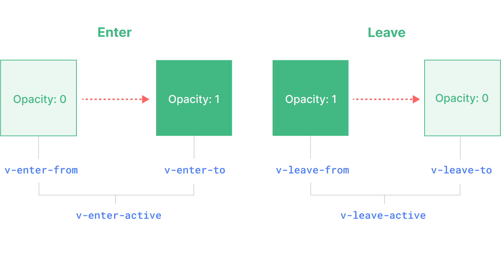

## 动画与过渡

在 Vue 3 中，动画和过渡是创建用户友好界面的重要部分。Vue 提供了强大的工具来实现元素的过渡和动画效果。本文将介绍过渡的基本使用、使用 Transition 组件以及动画的高级用法。

### 过渡的基本使用

过渡效果主要用于元素的插入、更新和移除。当元素状态发生变化时，可以通过过渡效果为用户提供视觉反馈。Vue 提供了简单的方式来实现这些效果。

#### 基本用法

通过 `v-if` 或 `v-show` 指令结合 `transition` 组件，可以轻松实现元素的过渡效果。

```html
<template>
  <div>
    <button @click="show = !show">Toggle</button>
    <Transition>
      <p v-if="show">hello</p>
    </Transition>
  </div>
</template>

<script>
  import { ref } from 'vue';

  export default {
    setup() {
      const show = ref(true);
      return { show };
    },
  };
</script>

<style>
  .v-enter-active,
  .v-leave-active {
    transition: opacity 0.5s ease;
  }

  .v-enter-from,
  .v-leave-to {
    opacity: 0;
  }
</style>
```

#### CSS 过渡 class



1、v-enter-from：进入动画的起始状态。在元素插入之前添加，在元素插入完成后的下一帧移除。

2、v-enter-active：进入动画的生效状态。应用于整个进入动画阶段。在元素被插入之前添加，在过渡或动画完成之后移除。这个 class 可以被用来定义进入动画的持续时间、延迟与速度曲线类型。

3、v-enter-to：进入动画的结束状态。在元素插入完成后的下一帧被添加 (也就是 v-enter-from 被移除的同时)，在过渡或动画完成之后移除。

4、v-leave-from：离开动画的起始状态。在离开过渡效果被触发时立即添加，在一帧后被移除。

5、v-leave-active：离开动画的生效状态。应用于整个离开动画阶段。在离开过渡效果被触发时立即添加，在过渡或动画完成之后移除。这个 class 可以被用来定义离开动画的持续时间、延迟与速度曲线类型。

6、v-leave-to：离开动画的结束状态。在一个离开动画被触发后的下一帧被添加 (也就是 v-leave-from 被移除的同时)，在过渡或动画完成之后移除。

#### 基本结构

`<transition>` 组件接受以下几个属性：

- `name`：指定过渡效果的类名前缀。
- `mode`：定义过渡模式（`in-out`、`out-in`）。

#### 示例

```html
<template>
  <div>
    <button @click="toggle">Toggle</button>
    <transition name="slide-fade">
      <p v-if="show">Sliding and Fading in Vue 3!</p>
    </transition>
  </div>
</template>

<script>
  import { ref } from 'vue';

  export default {
    setup() {
      const show = ref(true);
      const toggle = () => (show.value = !show.value);
      return { show, toggle };
    },
  };
</script>

<style>
  .slide-fade-enter-active {
    transition: all 0.5s ease;
  }
  .slide-fade-leave-active {
    transition: all 0.5s ease;
  }
  .slide-fade-enter-from, .slide-fade-leave-to {
    transform: translateX(10px);
    opacity: 0;
  }
</style>
```

### 动画的高级用法

高级动画使用包括自定义过渡类名、JavaScript 钩子函数、使用第三方动画库、动画组 (Transition Group) 和动态过渡等。

#### 自定义过渡类名

你可以通过 `<transition>` 组件的 `enter-active-class` 和 `leave-active-class` 属性自定义过渡类名。传入的这些 class 会覆盖相应阶段的默认 class 名。这个功能在你想要在 Vue 的动画机制下集成其他的第三方 CSS 动画库时非常有用，比如 Animate.css：

```html
<template>
  <div>
    <button @click="toggle">Toggle</button>
    <transition
      enter-active-class="animate__animated animate__fadeIn"
      leave-active-class="animate__animated animate__fadeOut"
    >
      <p v-if="show">Custom Transition Classes</p>
    </transition>
  </div>
</template>

<script>
  import { ref } from 'vue';

  export default {
    setup() {
      const show = ref(true);
      const toggle = () => (show.value = !show.value);
      return { show, toggle };
    },
  };
</script>
```

#### JavaScript 钩子函数

Vue 提供了 JavaScript 钩子函数，使得在过渡过程中执行自定义的 JavaScript 逻辑成为可能。

```html
<script setup>
import { ref } from 'vue'
import gsap from 'gsap'

const show = ref(true)

function onBeforeEnter(el) {
  gsap.set(el, {
    scaleX: 0.25,
    scaleY: 0.25,
    opacity: 1
  })
}
  
function onEnter(el, done) {
  gsap.to(el, {
    duration: 1,
    scaleX: 1,
    scaleY: 1,
    opacity: 1,
    ease: 'elastic.inOut(2.5, 1)',
    onComplete: done
  })
}

function onLeave(el, done) {
	gsap.to(el, {
    duration: 0.7,
    scaleX: 1,
    scaleY: 1,
    x: 300,
    ease: 'elastic.inOut(2.5, 1)'
  })
  gsap.to(el, {
    duration: 0.2,
    delay: 0.5,
    opacity: 0,
    onComplete: done
  })
}
</script>

<template>
  <button @click="show = !show">Toggle</button>

  <Transition
    @before-enter="onBeforeEnter"
    @enter="onEnter"
    @leave="onLeave"
    :css="false"
  >
    <div class="gsap-box" v-if="show"></div>
  </Transition>
</template>

<style>
.gsap-box {
  background: #42b883;
  margin-top: 20px;
  width: 30px;
  height: 30px;
  border-radius: 50%;
}
</style>
```
在使用仅由 JavaScript 执行的动画时，最好是添加一个 :css="false" prop。这显式地向 Vue 表明可以跳过对 CSS 过渡的自动探测。除了性能稍好一些之外，还可以防止 CSS 规则意外地干扰过渡效果。在有了 :css="false" 后，我们就自己全权负责控制什么时候过渡结束了。

#### 动态过渡

可以根据条件动态设置过渡效果。

```html
<template>
  <div>
    <button @click="toggle">Toggle</button>{{ transitionName }}
    <transition :name="transitionName">
      <div v-if="show" class="box">Dynamic Transition</div>
    </transition>
  </div>
</template>

<script>
  import { ref } from 'vue';

  export default {
    setup() {
      const show = ref(true);
      const transitionName = ref('fade');

      const toggle = () => {
        show.value = !show.value;
        transitionName.value = show.value ? 'fade' : 'slide';
      };

      return { show, transitionName, toggle };
    },
  };
</script>

<style>
  .fade-enter-active,
  .fade-leave-active {
    transition: opacity 3s;
  }
  .fade-enter-from,
  .fade-leave-to {
    opacity: 0.5;
  }

  .slide-enter-active,
  .slide-leave-active {
    transition: transform 1s;
  }
  .slide-enter-from,
  .slide-leave-to {
    transform: translateY(30px);
  }
</style>
```

#### 动画组 (Transition Group)

`<transition-group>` 用于为列表中的多个元素应用过渡效果。可以实现列表的插入、删除和移动动画。

```html
<template>
  <div>
    <button @click="addItem">Add Item</button>
    <transition-group name="list" tag="ul">
      <li v-for="item in items" :key="item" class="list-item">{{ item }}</li>
    </transition-group>
  </div>
</template>

<script>
  import { ref } from 'vue';

  export default {
    setup() {
      const items = ref(['Item 1', 'Item 2', 'Item 3']);

      const addItem = () => {
        items.value.push(`Item ${items.value.length + 1}`);
      };

      return { items, addItem };
    },
  };
</script>

<style>
  .list-enter-active,
  .list-leave-active {
    transition: all 0.5s ease;
  }
  .list-enter-from,
  .list-leave-to {
    opacity: 0;
    transform: translateX(30px);
  }
</style>
```
<TransitionGroup> 支持和 <Transition> 基本相同的 props、CSS 过渡 class 和 JavaScript 钩子监听器，但有以下几点区别：

- 默认情况下，它不会渲染一个容器元素。但你可以通过传入 tag prop 来指定一个元素作为容器元素来渲染。
- 过渡模式在这里不可用，因为我们不再是在互斥的元素之间进行切换。
- 列表中的每个元素都必须有一个独一无二的 key attribute。
- CSS 过渡 class 会被应用在列表内的元素上，而不是容器元素上

通过以上内容，您可以在 Vue 3 中实现从简单到复杂的动画和过渡效果，使应用更加生动和吸引用户。
