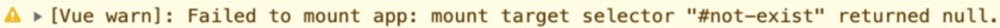

# 第一章 框架设计的核心要素
> 框架设计里到处都体现了权衡的艺术
- 框架应该给用户提供哪些构建产物?
- 产物的模块格式如何?当用户没有以预期的方式使用框架时，是否应该打印合适的警告信息从而提供更好的开发体验，让用户快速定位问题?
- 开发版本的构建和生产版本的构建有何区我们是否也应该考虑?
- 框架提供了多个功能，而用户只需要其中几个功能? 
- 热更新(hot module replacement，HMR)？

## 提升用户的开发体验

### 警告信息
```js
createApp(App).mount('#not-exist')
```

  
快速定位问题

## 控制框架代码的体积

框架的大小也是衡量框架的标准之一。在实现同样功能的情况下，当然是用的代码越少越好，这样体积就会越小，最后浏览器加载资源的时间也就越少。
```js
if (__DEV__ && !res) {
   warn(`Failed to mount app: mount target selector "${container}"eturned null.`)
}
```
vue 使用 rollup进行打包，输出vue.global.js和vue.global.prod.js两个版本，dead code在prod版本中不会存在

## 框架要做到良好的Tree-Sharking
Tree-Shaking 指的就是消除那些永远不会被执行的代码，也就是排除 dead code
### 模块必须是ESM(ES Module)

```js
// input.js
import { foo } from './utils.js'
foo()

// utils.js
export function foo(obj) {
  obj && obj.foo
 }
 export function bar(obj) {
   obj && obj.bar
}

// npx rollup input.js -f esm -o bundle.js

// bundle.js
function foo(obj) {
  obj && obj.foo
}
foo();
```
bar 函数作为 dead code 被删除了

### 副作用
如果一个函数调用会产生副作用，那么就不能将其移除,
副作用就是当调用函数的时候会对外部产生影响

```js
import {foo} from './utils'
/*#__PURE__*/ foo()
```
注释代码 /*#__PURE__*/，其作用就是告诉 rollup.js，对于 foo 函数的调用不会产生副作用，你可以放心地对其进行 Tree-Shaking，

## 框架应该输出怎样的构建产物

- IIFE 格式的资源
- module 格式
- commond js 格式

> IIFE 的全称是 Immediately Invoked Function Expression，即“立即调用的 函数表达式”
```js
(function () {
  // ...
})()

var Vue = (function(exports){
  // ...
  exports.createApp = createApp;
  // ...
  return exports
}({}))
```
### 

## 特性开关
特性开关的好处
- Tree-sharking 不打包用户关闭的特性
- 升级框架时使得打包体积最小化

## 错误处理
框架错误处理机制的好坏直接决定了用户应用程序的健壮性，还决定了用户开发时处理错误的心智负担。

```js
 // utils.js
export default {
  foo(fn) {} 
}

// 不处理
import utils from 'utils.js'
utils.foo(() => {
 // ...
})

// 初级处理
import utils from 'utils.js'
utils.foo(() => {
 try {
  // ...
 } catch (e) {

 }
})

// 统一处理
// utils.js
export default {
  foo(fn) {
    try {
      fn && fn()
    } catch(e) {/* ... */}
  },
  bar(fn) {
    try {
      fn && fn()
    } catch(e) {/* ... */}
  },
}

// 统一抽离处理错误
let handleError = null 
export default {
  foo(fn) {
    callWithErrorHandling(fn)
  },
  //  用户可以调用该函数注册统一的错误处理函数
  registerErrorHandler(fn) {
    handleError = fn
  }
}
function callWithErrorHandling(fn) {
  try {
    fn && fn()
  } catch (e) {
    console.log(e)
  }
}

import utils from 'utils.js' 02 // 注册错误处理程序
utils.registerErrorHandler((e) => {
  // 用户既可以选择忽略错误，也可以调用上报程序将错误上报给监控系统。
  console.log(e)
})
utils.foo(() => {/*...*/})
utils.bar(() => {/*...*/})
```

## 良好的TypeScript类型支持

