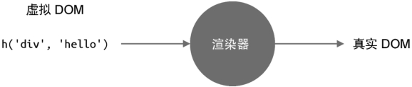
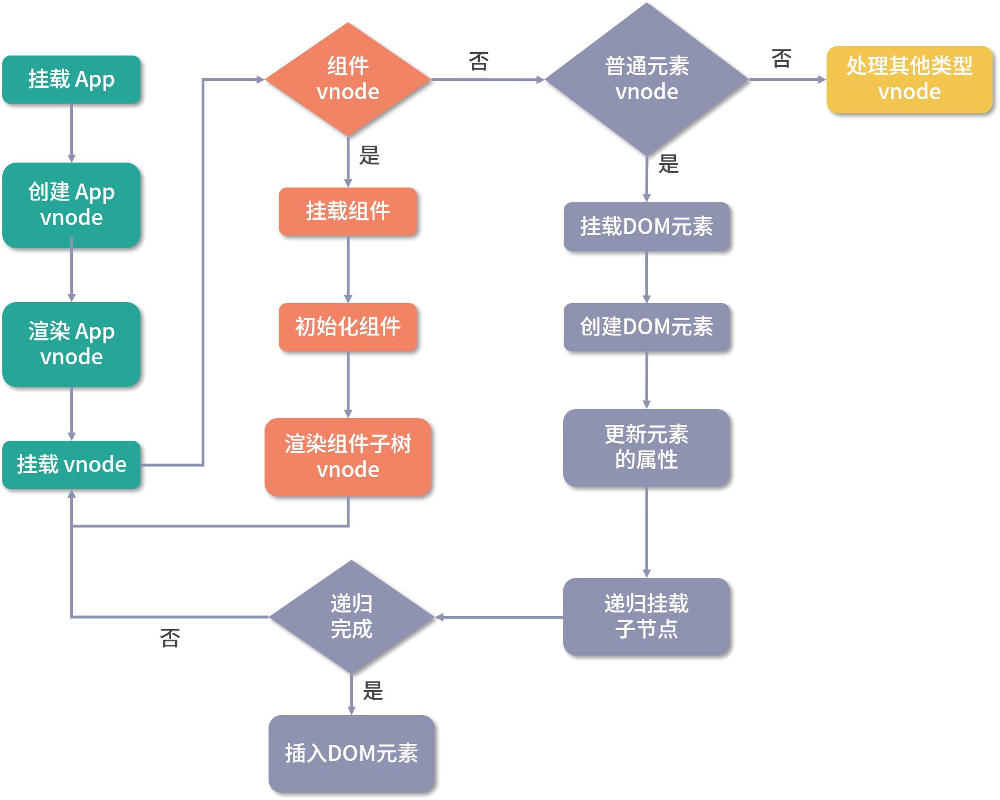

# 第三章 Vue.js 3 的设计思路

## 本章内容

- 声明式地描述 UI
- 初识渲染器
- 组件的本质
- 模板的工作原理

### 知识点回顾

**权衡的艺术：**声明式和命令式、性能和可维护性、运行时和编译时
**框架设计核心要素：**开发体验、代码体积、错误处理、ts 支持等

## 3.1 声明式地描述 UI

Vue.js 3 是一个声明式的 UI 框架，意思是说用户在使用 Vue.js 3 **开发页面时**是声明式地描述 UI 的

### 3.1.1 前端页面涉及到的内容

- `DOM` 元素：例如是 `div` 标签还是 `a` 标签。
- 属性：如 `a` 标签的 `href` 属性，再如 `id`、`class` 等通用属性。
- 事件：如 `click`、`keydown` 等。
- 元素的层级结构：`DOM` 树的层级结构，既有子节点，又有父节点

### 3.1.2 怎么用声明式来描述页面呢？

- 使用与 `HTML` 标签一致的方式来描述 DOM 元素，例如描述一个 `div` 标签时可以使用`<div></div>`；
- 使用与 `HTML` 标签一致的方式来描述属性，例如`<divid="app"></div>`；
- 使用`:`或 `v-bind` 来描述动态绑定的属性，例如`<div:id="dynamicId"></div>`；
- 使用`@`或 `v-on` 来描述事件，例如点击事件`<div@click="handler"></div>`；
- 使用与 `HTML` 标签一致的方式来描述层级结构，例如一个具有 `span` 子节点的 `div` 标签`<div><span></span></div>`

以上其实就是我们 `vue` 中模板`template`的写法,除了以上实现，还可以使用 `js` 对象来描述

```js
const title = {
  tag: "h1",
  props: {
    onClick: handleClick,
  },
  children: [
    {
      tag: "span",
      children: "title text",
    },
  ],
};
```

对应的 Vue 模板就是：

```html
<h1 @click="handleClick"><span>title text</span></h1>
```

使用 `js` 对象来描述的页面其实就是我们所说的虚拟 DOM，所以 Vue.js3 除了支持使用模板描述 UI 外，还支持使用虚拟 DOM 描述 UI

我们来看下 vue 是怎么支持虚拟 DOM 来描述 UI 的

```js
import { h } from "vue";
export default {
  render() {
    return h("h1", { onClick: () => {} }, [h("span", "title text")]);
  },
};
```

`h` 函数返回结果就是虚拟 DOM

## 3.2 初识渲染器

渲染器的作用就是把虚拟 DOM 渲染为真实 DOM，如图所示


**h 函数**返回的就是虚拟 DOM

简单的渲染器实现：

```js
//渲染器
function renderer(vnode, container) {
  // 使用 vnode.tag 作为标签名称创建 DOM 元素03
  const el = document.createElement(vnode.tag);
  // 遍历 vnode.props，将属性、事件添加到 DOM 元素
  for (const key in vnode.props) {
    if (/^on/.test(key)) {
      // 如果 key 以 on 开头，说明它是事件
      el.addEventListener(
        key.substr(2).toLowerCase(),
        // 事件名称 onClick --->click
        vnode.props[key]
        // 事件处理函数
      );
    }
  }
  // 处理 children
  if (typeof vnode.children === "string") {
    // 如果 children 是字符串，说明它是元素的文本子节点
    el.appendChild(document.createTextNode(vnode.children));
  } else if (Array.isArray(vnode.children)) {
    // 递归地调用 renderer 函数渲染子节点，使用当前元素 el 作为挂载点
    vnode.children.forEach((child) => renderer(child, el));
  }
  // 将元素添加到挂载点下
  container.appendChild(el);
}
// 虚拟 DOM
const vnode = {
  tag: "div",
  props: {
    onClick: () => alert("hello"),
  },
  children: "click me",
};

//执行渲染器
renderer(vnode, document.body); // body 作为挂载点
```

## 3.3 组件的本质

上面我们初步了解了`虚拟DOM`和`渲染器`，我们思考下下面几个问题

- 组件是什么？
- 组件和虚拟 DOM 有什么关系？
- 渲染器如何渲染组件的？

其实虚拟 DOM 除了能够描述真实 DOM 之外，还能够描述组件，怎么描述组件？想要弄明白这个问题，就需要先搞清楚组件的本质是什么。一句话总结：**组件就是一组 DOM 元素的封装**，这组 DOM 元素就是组件要渲染的内容。

下面我们使用函数定义一个组件，函数的返回值就是要渲染的内容

```js
const MyComponent = function () {
  return {
    tag: "div",
    props: {
      onClick: () => alert("hello"),
    },
    children: "click me",
  };
};
```

使用虚拟 DOM 描述组件：

```js
const vnode = {
  tag: MyComponent,
};
```

有了虚拟 DOM 我们还得借助渲染器：

```js
//渲染器
function renderer(vnode, container) {
  if (typeof vnode.tag === "string") {
    //  vnode 描述的是标签元素
    mountElement(vnode, container);
  } else if (typeof vnode.tag === "function") {
    //  vnode 描述的是组件
    mountComponent(vnode, container);
  }
}

function mountElement(vnode, container) {
  // 使用 vnode.tag 作为标签名称创建 DOM 元素
  const el = document.createElement(vnode.tag);
  // 遍历 vnode.props，将属性、事件添加到 DOM 元素
  for (const key in vnode.props) {
    if (/^on/.test(key)) {
      // 如果 key 以字符串 on 开头，说明它是事件
      el.addEventListener(
        key.substr(2).toLowerCase(), // 事件名称 onClick --->click
        vnode.props[key] // 事件处理函数
      );
    }
  }
  // 处理 children
  if (typeof vnode.children === "string") {
    // 如果 children 是字符串，说明它是元素的文本子节点
    el.appendChild(document.createTextNode(vnode.children));
  } else if (Array.isArray(vnode.children)) {
    // 递归地调用 renderer 函数渲染子节点，使用当前元素 el 作为挂载点
    vnode.children.forEach((child) => renderer(child, el));
  }
  // 将元素添加到挂载点下
  container.appendChild(el);
}

//挂在组件
function mountComponent(vnode, container) {
  // 调用组件函数，获取组件要渲染的内容（虚拟 DOM）
  const subtree = vnode.tag();
  // 递归地调用 renderer 渲染 subtree
  renderer(subtree, container);
}
```

以上我们渲染了一个组件，组件除了是函数之外还可以是一个 JS 对象
例如：

```js
const MyComponent = {
  render() {
    return vnode;
  },
};

//挂载组件
function mountComponent(vnode, container) {
  // 调用组件函数，变更位置
  const subtree = vnode.tag.render();
  // 递归地调用 renderer 渲染 subtree
  renderer(subtree, container);
}
```

其实 Vue.js 中的有状态组件就是使用对象结构来表达的



## 3.4 模板的工作原理

关于模板的工作， 这就要提到 Vue.js 框架中的另外一个重要组成部分：**编译器**

编译器的作用其实就是将`模板`编译为`渲染函数`

```html
<template>
  <div @click="handler">click me</div>
</template>
<script>
  export default {
    data() {
      /* ... */
    },
    methods: {
      handler: () => {
        /* ... */
      },
    },
  };
</script>
```

通过编译器编译后:

```js
export default {
  data() {
    /* ... */
  },
  methods: {
    handler: () => {
      /* ... */
    },
  },
  render() {
    return h("div", { onClick: handler }, "click me");
  },
};
```

## 3.5 Vue.js 是各个模块组成的有机整体

组件的实现依赖于渲染器，模板的编译依赖于编译器，并且编译后生成的代码是根据渲染器和虚拟 DOM 的设计决定的，
因此 Vue.js 的各个模块之间是互相关联、互相制约的，共同构成一个有机整体。因此，我们在学习 Vue.js 原理的时候，应该把各个模块结合到一起去看，才能明白到底是怎么回事。

```
├── packages             // vue 源码核心包，使用 pnpm workspace 工作区管理
│   ├── compiler-core    // 编译器（平台无关），例如基础的 baseCompile 编译模版文件, baseParse生成AST
│   ├── compiler-dom     // 基于compiler-core，专为浏览器的编译模块，可以看到它基于baseCompile，baseParse，重写了complie、parse
│   ├── compiler-sfc     // 编译vue单文件组件
│   ├── compiler-ssr     // 服务端渲染编译
│   ├── reactivity       // vue独立的响应式模块，可以与任何框架配合,使用proxy
│   ├── reactivity-transform  // 响应式实验功能，目前仅用于测试
│   ├── runtime-core     // 与平台无关的运行时。有虚拟DOM渲染器，vue组件和各种API。可针对某个具体平台实现高阶runtime，比如自定义渲染器
│   ├── runtime-dom      // 针对浏览器的runtime。包含处理原生DOM API
│   ├── runtime-test     // 一个专门为了测试而写的轻量级 runtime。由于这个 rumtime 「渲染」出的 DOM 树其实是一个 JS 对象，所以这个 runtime 可以用在所有 JS 环境里。你可以用它来测试渲染是否正确。
│   ├── server-renderer     // 服务端渲染
│   ├── sfc-playground
│   ├── shared             // 内部工具库,不暴露API
│   ├── size-check          // 简单应用，用来测试代码体积
│   ├── template-explorer  // 用于调试编译器输出的开发工具
│   └── vue                 // 面向公众的完整版本, 包含运行时和编译器
│   └── vue-compat          // 用于兼容 vue2

```

## 3.6 总结

1. **我们首先介绍了声明式地描述 UI 的概念。**
   我们知道，Vue.js 是一个声明式的框架。声明式的好处在于，它直接描述结果，用户不需要关注过程。Vue.js 采用模板的方式来描述 UI，但它同样支持使用虚拟 DOM 来描述 UI。虚拟 DOM 要比模板更加灵活，但模板要比虚拟 DOM 更加直观

2. **然后我们讲解了最基本的渲染器的实现。**
   渲染器的作用是，把虚拟 DOM 对象渲染为真实 DOM 元素。它的工作原理是，递归地遍历虚拟 DOM 对象，并调用原生 DOM API 来完成真实 DOM 的创建。渲染器的精髓在于后续的更新，它会通过 Diff 算法找出变更点，并且只会更新需要更新的内容。后面我们会专门讲解渲染器的相关知识
3. **接着，我们讨论了组件的本质。**
   组件其实就是一组虚拟 DOM 元素的封装，它可以是一个返回虚拟 DOM 的函数，也可以是一个对象，但这个对象下必须要有一个函数用来产出组件要渲染的虚拟 DOM。渲染
   器在渲染组件时，会先获取组件要渲染的内容，即执行组件的渲染函数并得到其返回值，我们称之为 subtree，最后再递归地调用渲染器将 subtree 渲染出来即可
4. **Vue.js 的模板会被一个叫作编译器的程序编译为渲染函数**

`编译器`、`渲染器`都是 Vue.js 的核心组成部分，它们共同构成一个有机的整体，不同模块之间互相配合，进一步提升框架性能。
