# 第四章 响应系统的作用与实现

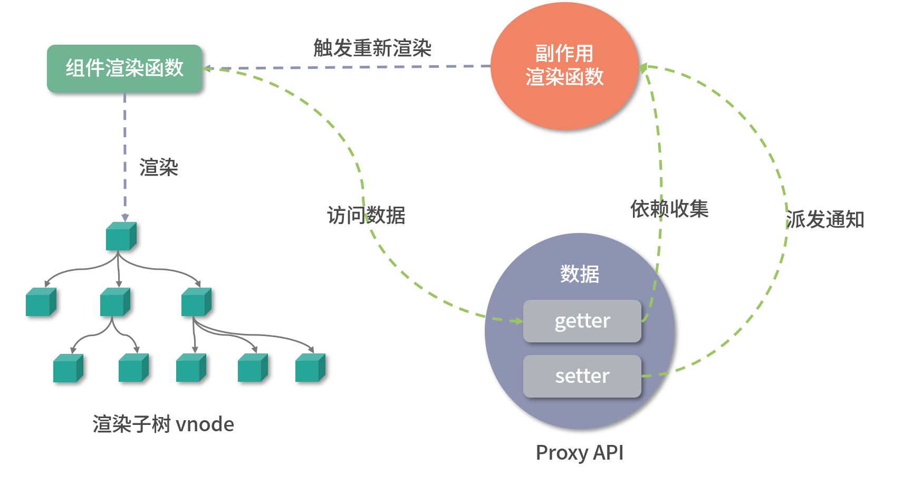

## 本章内容

- 响应式数据与副作用函数
- 响应式数据的基本实现
- 设计一个完善的响应系统
- 分支切换与 cleanup
- 嵌套的 effect 与 effect 栈
- 避免无限递归循环
- 调度执行
- 计算属性 computed 与 lazy
- watch 的实现原理
- 立即执行的 watch 与回调执行时机
- 过期的副作用

## 4.1 响应式数据与副作用函数

### 4.1.1 回顾下副作用函数

副作用函数指的是会产生副作用的函数

```js
function effect() {
  document.body.innerText = "hello vue3";
}
```

当 effect 函数执行时，它会设置 body 的文本内容，但除了 effect 函数之外的任何函数都可以读取或设置 body 的文本内容。也就是说，effect 函数的执行会直接或间接影响其他函数的执行，这时我们说 effect 函数产生了副作用。

副作用很容易产生，例如一个函数修改了全局变量，这其实也是一个副作用，如下面的代码所示：

```js
// 全局变量
let val = 1;
function effect() {
  val = 2; // 修改全局变量，产生副作用
}
```

### 4.1.2 什么是响应式数据?

假设在一个副作用函数中读取了某个对象的属性

```js
const obj = { text: "hello world" };
function effect() {
  // effect 函数的执行会读取 obj.text
  document.body.innerText = obj.text;
}

obj.text = "hello vue3"; // 修改 obj.text 的值，同时希望副作用函数会重新执行
```

如上面的代码所示，副作用函数 effect 会设置 body 元素的 innerText 属性，其值为 obj.text，当 obj.text 的值发生变化时，我们希望副作用函数 effect 会重新执行,如果能实现这个目标，那么对象 obj 就是响应式数据

## 4.2 响应式数据的基本实现

如何才能让 obj 变成响应式数据呢？通过观察我们能发现两点线索:

- 当副作用函数 effect 执行时，会触发字段 obj.text 的读取操作；
- 当修改 obj.text 的值时，会触发字段 obj.text 的设置操作

如果我们能拦截一个对象的读取和设置操作

当读取字段 obj.text 时，我们可以把副作用函数 effect 存储到一个“桶”里，如图：
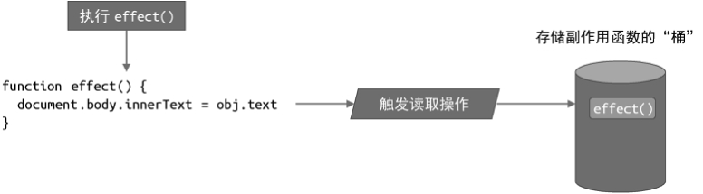

当设置 obj.text 时，再把副作用函数 effect 从“桶”里取出并执行即可，如图：

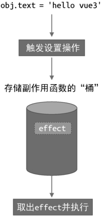

现在问题的关键变成了我们如何才能拦截一个对象属性的读取和设置操作。在 ES2015 之前，只能通过 Object.defineProperty 函数实现，这也是 Vue.js 2 所采用的方式。在 ES2015+ 中，我们可以使用代理对象 Proxy 来实现，这也是 Vue.js 3 所采用的方式

顺着这个思路，我们简单实现下 [△ 运行代码](https://code.juejin.cn/pen/7346110581688303667)

```js
// 存储副作用函数的桶
const bucket = new Set();
// 原始数据
const data = { text: "hello world" };
// 对原始数据的代理
const obj = new Proxy(data, {
  // 拦截读取操作
  get(target, key) {
    // 将副作用函数 effect 添加到存储副作用函数的桶中
    bucket.add(effect);
    // 返回属性值
    return target[key];
  },
  // 拦截设置操作
  set(target, key, newVal) {
    // 设置属性值
    target[key] = newVal;
    // 把副作用函数从桶里取出并执行
    bucket.forEach((fn) => fn());
    // 返回 true 代表设置操作成功
    return true;
  },
});

// 副作用函数
function effect() {
  document.body.innerText = obj.text;
}
// 执行副作用函数，触发读取
effect();

// 1 秒后修改响应式数据
setTimeout(() => {
  obj.text = "hello vue3";
}, 1000);
```

至此，我们已经实现了一个微型响应系统

## 4.3 设计一个完善的响应系统

从上一节的例子中不难看出，一个响应系统的工作流程如下：

- 当读取操作发生时，将副作用函数收集到“桶”中；
- 当设置操作发生时，从“桶”中取出副作用函数并执行

### 4.3.1 解决硬编码，实现匿名的副作用函数

我们硬编码了副作用函数的名字（effect），导致一旦副作用函数的名字不叫 effect，那么这段代码就不能正确地工作了。

实现匿名的副作用函数

[△ 运行代码](https://code.juejin.cn/pen/7346119797316419636)

```js
// 用一个全局变量存储被注册的副作用函数
let activeEffect;
// effect 函数用于注册副作用函数
function effect(fn) {
  // 当调用 effect 注册副作用函数时，将副作用函数 fn 赋值给activeEffect
  activeEffect = fn;
  // 执行副作用函数
  fn();
}

effect(
  // 一个匿名的副作用函数
  () => {
    document.body.innerText = obj.text;
  }
);

const obj = new Proxy(data, {
  get(target, key) {
    // 将 activeEffect 中存储的副作用函数收集到“桶”中
    if (activeEffect) {
      // 新增
      bucket.add(activeEffect); // 新增
    }
    // 新增
    return target[key];
  },
  set(target, key, newVal) {
    target[key] = newVal;
    bucket.forEach((fn) => fn());
    return true;
  },
});
```

### 4.3.2 重新设计“桶”的数据结构

添加一个不存在的属性：

```js
setTimeout(() => {
  obj.name = "响应系统";
}, 1000);
```

运行结果：副作用函数也被执行了

字段 obj.notExist 并没有与副作用建立响应联系，定时器内语句的执行不应该触发匿名副作用函数重新执行。导致该问题的根本原因是，**我们没有在副作用函数与被操作的目标字段之间建立明确的联系**。我们需要重新设计“桶”的数据结构

#### 1、 副作用函数与被操作的目标字段的关系

观察以上的副作用函数中有几个重要的要素：

```js
effect(function effectFn() {
  document.body.innerText = obj.text;
});
```

- 被操作（读取）的代理对象 obj；
- 被操作（读取）的字段名 text；
- 使用 effect 函数注册的副作用函数 effectFn。

如果用 target 来表示一个代理对象所代理的原始对象，用 key 来表示被操作的字段名，用 effectFn 来表示被注册的副作用函数，那么可以为这三个角色建立如下关系：

```
  target
    └──key
        └──effectFn
```

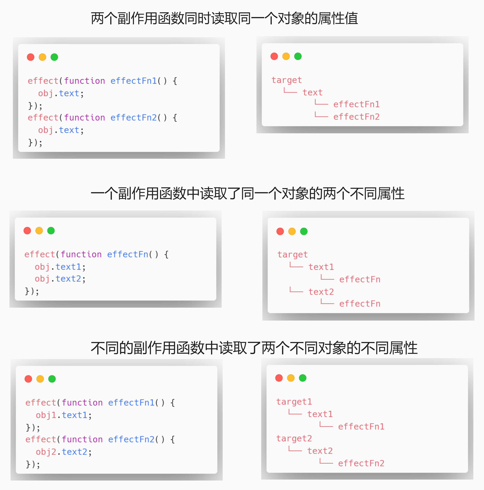

总之，这其实就是一个树型数据结构。这个联系建立起来之后，就可以解决前文提到的问题了。

#### 2、 “桶”的数据结构

接下来我们尝试用代码来实现这个新的“桶”。首先，需要使用 WeakMap 代替 Set 作为桶的数据结构

```js
// 存储副作用函数的桶
const bucket = new WeakMap();
const obj = new Proxy(data, {
  // 拦截读取操作
  get(target, key) {
    // 没有 activeEffect，直接 return
    if (!activeEffect) return target[key];
    // 根据 target 从“桶”中取得 depsMap，它也是一个 Map 类型：key -->effects
    let depsMap = bucket.get(target);
    // 如果不存在 depsMap，那么新建一个 Map 并与 target 关联
    if (!depsMap) {
      bucket.set(target, (depsMap = new Map()));
    }
    // 再根据 key 从 depsMap 中取得 deps，它是一个 Set 类型，
    // 里面存储着所有与当前 key 相关联的副作用函数：effects
    let deps = depsMap.get(key);
    // 如果 deps 不存在，同样新建一个 Set 并与 key 关联
    if (!deps) {
      depsMap.set(key, (deps = new Set()));
    }
    // 最后将当前激活的副作用函数添加到“桶”里
    deps.add(activeEffect);
    // 返回属性值
    return target[key];
  },
  // 拦截设置操作
  set(target, key, newVal) {
    // 设置属性值
    target[key] = newVal;
    // 根据 target 从桶中取得 depsMap，它是 key --> effects
    const depsMap = bucket.get(target);
    if (!depsMap) return;
    // 根据 key 取得所有副作用函数 effects
    const effects = depsMap.get(key);
    // 执行副作用函数
    effects && effects.forEach((fn) => fn());
  },
});
```

从这段代码可以看出构建数据结构的方式，我们分别使用了 WeakMap、Map 和 Set：

- WeakMap 由 target --> Map 构成；
- Map 由 key --> Set 构成。

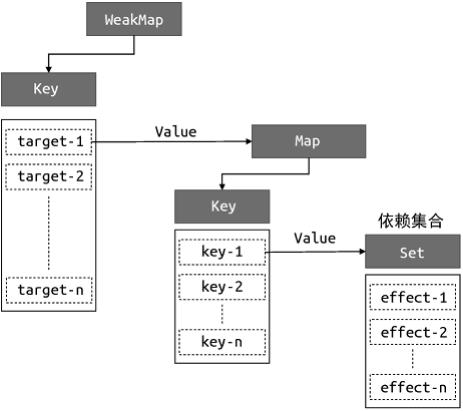

为了方便描述，我们把图中的 Set 数据结构所存储的副作用函数集合称为 key 的依赖集合

**思考**：这里为什么要使用 WeakMap？

我们对上文中的代码做一些封装处理。在目前的实现中，当读取属性值时，我们直接在 get 拦截函数里编写把副作用函数收集到“桶”里的这部分逻辑，但更好的做法是将这部分逻辑单独封装到一个 track 函数中，函数的名字叫 track 是为了表达追踪的含义。同样，我们也可以把触发副作用函数重新执行的逻辑封装到 trigger 函数中：

```js
const obj = new Proxy(data, {
  // 拦截读取操作
  get(target, key) {
    // 将副作用函数 activeEffect 添加到存储副作用函数的桶中
    track(target, key);
    // 返回属性值
    return target[key];
  },
  // 拦截设置操作
  set(target, key, newVal) {
    // 设置属性值
    target[key] = newVal;
    // 把副作用函数从桶里取出并执行
    trigger(target, key);
  },
});
// 在 get 拦截函数内调用 track 函数追踪变化
function track(target, key) {
  // 没有 activeEffect，直接 return
  if (!activeEffect) return;
  let depsMap = bucket.get(target);
  if (!depsMap) {
    bucket.set(target, (depsMap = new Map()));
  }
  let deps = depsMap.get(key);
  if (!deps) {
    depsMap.set(key, (deps = new Set()));
  }
  deps.add(activeEffect);
}
// 在 set 拦截函数内调用 trigger 函数触发变化
function trigger(target, key) {
  const depsMap = bucket.get(target);
  if (!depsMap) return;
  const effects = depsMap.get(key);
  effects && effects.forEach((fn) => fn());
}
```

[△ 运行代码](https://code.juejin.cn/pen/7346419420283011081)
如以上代码所示，分别把逻辑封装到 track 和 trigger 函数内，这能为我们带来极大的灵活性。

## 4.4 分支切换与 cleanup

### 4.4.1 什么是分支切换

```js
const data = { ok: true, text: "hello world" };
const obj = new Proxy(data, {
  /* ... */
});
effect(function effectFn() {
  document.body.innerText = obj.ok ? obj.text : "not";
});
```

在 effectFn 函数内部存在一个三元表达式，根据字段 obj.ok 值的不同会执行不同的代码分支。当字段 obj.ok 的值发生变化时，代码执行的分支会跟着变化，这就是所谓的分支切换。

分支切换可能会产生遗留的副作用函数。拿上面这段代码来说，字段 obj.ok 的初始值为 true，这时会读取字段 obj.text 的值，所以当 effectFn 函数执行时会触发字段 obj.ok 和字段 obj.text 这两个属性的读取操作，此时副作用函数 effectFn 与响应式数据之间建立的联系如下：

```js
data
  └── ok
      └── effectFn
  └── text
      └── effectFn
```

如果 obj.ok 切换为 false 时，重新执行副作用函数，由于此时字段 obj.text 不会被读取，只会触发字段 obj.ok 的读取操作，所以理想情况下副作用函数 effectFn 不应该被字段 obj.text 所对应的依赖集合收集。这时就产生了遗留的副作用函数，遗留的副作用函数会导致不必要的更新 [△ 运行代码](https://code.juejin.cn/pen/7346423325209886771)

```js
data
  └── ok
      └── effectFn
```

解决这个问题的思路很简单，每次副作用函数执行时，我们可以先把它从所有与之关联的依赖集合中删除

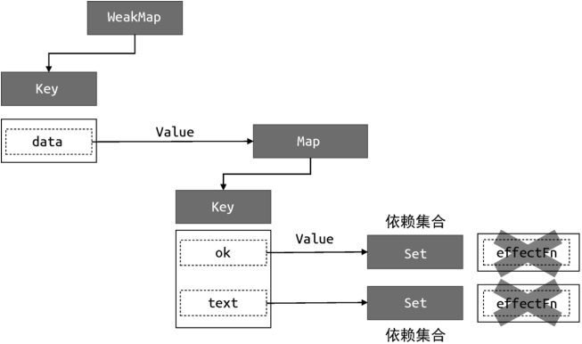

### 4.4.2 实现 cleanup

这部分我们来实现如何断开副作用函数与响应式数据之间的联系，要将一个副作用函数从所有与之关联的依赖集合中移除，就需要明确知道哪些依赖集合中包含它，我们需要**重新设计副作用函数**，

如下面的代码所示。在 effect 内部我们定义了新的 effectFn 函数，并为其添加了 effectFn.deps 属性，该属性是一个数组，用来存储所有包含当前副作用函数的依赖集合

```js
// 用一个全局变量存储被注册的副作用函数
let activeEffect;
function effect(fn) {
  const effectFn = () => {
    // 当 effectFn 执行时，将其设置为当前激活的副作用函数
    activeEffect = effectFn;
    fn();
  };
  // activeEffect.deps 用来存储所有与该副作用函数相关联的依赖集合
  effectFn.deps = [];
  // 执行副作用函数
  effectFn();
}
```

那么 effectFn.deps 数组中的依赖集合是如何收集的呢？

```js
function track(target, key) {
  // 没有 activeEffect，直接 return
  if (!activeEffect) return;
  let depsMap = bucket.get(target);
  if (!depsMap) {
    bucket.set(target, (depsMap = new Map()));
  }
  let deps = depsMap.get(key);
  if (!deps) {
    depsMap.set(key, (deps = new Set()));
  }
  // 把当前激活的副作用函数添加到依赖集合 deps 中
  deps.add(activeEffect);
  // deps 就是一个与当前副作用函数存在联系的依赖集合
  // 将其添加到 activeEffect.deps 数组中
  activeEffect.deps.push(deps); // 新增
}
```

在 track 函数中我们将当前执行的副作用函数 activeEffect 添加到依赖集合 deps 中，这说明 deps 就是一个与当前副作用函数存在联系的依赖集合，于是我们也把它添加到 activeEffect.deps 数组中，这样就完成了对依赖集合的收集。

有了这个联系后，我们就可以在每次副作用函数执行时，根据 effectFn.deps 获取所有相关联的依赖集合，进而将副作用函数从依赖集合中移除

副作用中移除：

```js
// 用一个全局变量存储被注册的副作用函数
let activeEffect;
function effect(fn) {
  const effectFn = () => {
    // 调用 cleanup 函数完成清除工作
    cleanup(effectFn); // 新增
    activeEffect = effectFn;
    fn();
  };
  effectFn.deps = [];
  effectFn();
}
```

cleanup 的实现：

```js
function cleanup(effectFn) {
  // 遍历 effectFn.deps 数组
  for (let i = 0; i < effectFn.deps.length; i++) {
    // deps 是依赖集合
    const deps = effectFn.deps[i];
    // 将 effectFn 从依赖集合中移除
    deps.delete(effectFn);
  }
  // 最后需要重置 effectFn.deps 数组
  effectFn.deps.length = 0;
}
```

cleanup 函数接收副作用函数作为参数，遍历副作用函数的 effectFn.deps 数组，该数组的每一项都是一个依赖集合，然后将该副作用函数从依赖集合中移除，最后重置 effectFn.deps 数组。

至此，我们的响应系统已经可以避免副作用函数产生遗留了。但如果你尝试运行代码，会发现目前的实现会导致无限循环执行，问题出在 trigger 函数中：

```js
// 在 set 拦截函数内调用 trigger 函数触发变化
function trigger(target, key) {
  const depsMap = bucket.get(target);
  if (!depsMap) return;
  const effects = depsMap.get(key);
  effects && effects.forEach((effectFn) => effectFn()); // 问题代码 删除
}
```

在 trigger 函数内部，我们遍历 effects 集合，它是一个 Set 集合，里面存储着副作用函数。当副作用函数执行时，会调用 cleanup 进行清除，实际上就是从 effects 集合中将当前执行的副作用函数剔除，但是副作用函数的执行会导致其重新被收集到集合中，而此时对于 effects 集合的遍历仍在进行。

```js
// 在 set 拦截函数内调用 trigger 函数触发变化
function trigger(target, key) {
  const depsMap = bucket.get(target);
  if (!depsMap) return;
  const effects = depsMap.get(key);
  //effects && effects.forEach(effectFn => effectFn()) // 问题代码 删除
  const effectsToRun = new Set(effects); // 新增
  effectsToRun.forEach((effectFn) => effectFn()); // 新增
}
```

我们现在已经实现了 cleanup，解决了 分支切换 的问题。[△ 运行代码](https://code.juejin.cn/pen/7346468034992668672)

## 4.5 嵌套的 effect 与 effect 栈

effect 是可以发生嵌套的，例如:

```js
effect(function effectFn1() {
  effect(function effectFn2() {
    /* ... */
  });
});
```

在上面这段代码中，effectFn1 内部嵌套了 effectFn2，effectFn1 的执行会导致 effectFn2 的执行。那么，什么场景下会出现嵌套的 effect 呢？拿 Vue.js 来说，实际上 Vue.js 的渲染函数就是在一个 effect 中执行的：

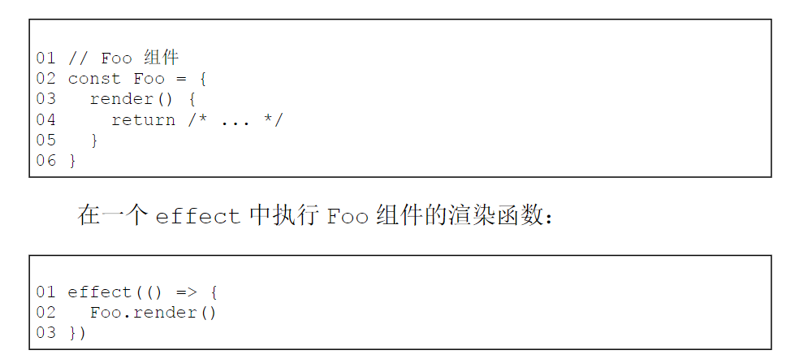

出现嵌套的场景：
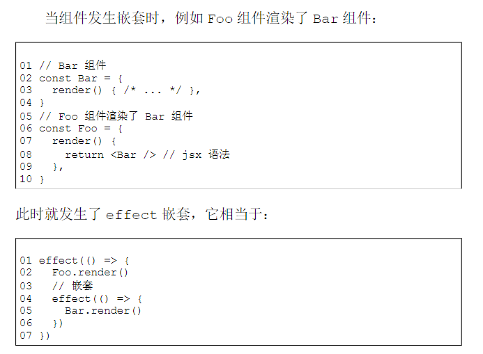

这个例子说明了为什么 effect 要设计成可嵌套的。接下来，我们需要搞清楚，如果 effect 不支持嵌套会发生什么？实际上，按照前文的介绍与实现来看，我们所实现的响应系统并不支持 effect 嵌套

例子：

```js
// 原始数据
const data = { foo: true, bar: true };
// 代理对象
const obj = new Proxy(data, {
  /* ... */
});
// 全局变量
let temp1, temp2; // effectFn1 嵌套了 effectFn2
effect(function effectFn1() {
  console.log("effectFn1 执行");
  effect(function effectFn2() {
    console.log("effectFn2 执行");
    // 在 effectFn2 中读取 obj.bar 属性
    temp2 = obj.bar;
  });
  // 在 effectFn1 中读取 obj.foo 属性
  temp1 = obj.foo;
});
```

理想的结构

```
data
  └── foo
       └── effectFn1
  └── bar
       └── effectFn2
```

问题：初始的时候，effectFn1 和 effectFn2 都会执行一次，当我们修改了 data.foo，应该执行 effectFn1，但是实际上执行了 effectFn2

问题出在哪里呢？其实就出在我们实现的 effect 函数与 activeEffect 上。

我们用全局变量 activeEffect 来存储通过 effect 函数注册的副作用函数，这意味着同一时刻 activeEffect 所存储的副作用函数只能有一个。当副作用函数发生嵌套时，内层副作用函数的执行会覆盖 activeEffect 的值，并且永远不会恢复到原来的值。这时如果再有响应式数据进行依赖收集，即使这个响应式数据是在外层副作用函数中读取的，它们收集到的副作用函数也都会是内层副作用函数，这就是问题所在。

为了解决这个问题，我们需要一个副作用函数栈 effectStack，在副作用函数执行时，将当前副作用函数压入栈中，待副作用函数执行完毕后将其从栈中弹出，并始终让 activeEffect 指向栈顶的副作用函数。这样就能做到一个响应式数据只会收集直接读取其值的副作用函数，而不会出现互相影响的情况，如以下代码所示：

```js
// 用一个全局变量存储当前激活的 effect 函数
let activeEffect;
// effect 栈
const effectStack = []; // 新增
function effect(fn) {
  const effectFn = () => {
    cleanup(effectFn);
    // 当调用 effect 注册副作用函数时，将副作用函数赋值给 activeEffect
    activeEffect = effectFn;
    // 在调用副作用函数之前将当前副作用函数压入栈中
    effectStack.push(effectFn); // 新增
    fn();
    // 在当前副作用函数执行完毕后，将当前副作用函数弹出栈，并把activeEffect 还原为之前的值
    effectStack.pop(); // 新增
    activeEffect = effectStack[effectStack.length - 1]; // 新增
  };
  // activeEffect.deps 用来存储所有与该副作用函数相关的依赖集合
  effectFn.deps = [];
  // 执行副作用函数
  effectFn();
}
```

我们定义了 effectStack 数组，用它来模拟栈，activeEffect 没有变化，它仍然指向当前正在执行的副作用函数。不同的是，当前执行的副作用函数会被压入栈顶，这样当副作用函数发生嵌套时，栈底存储的就是外层副作用函数，而栈顶存储的则是内层副作用函数，如图:
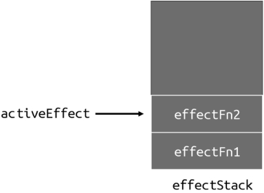

当内层副作用函数 effectFn2 执行完毕后，它会被弹出栈，并将副作用函数 effectFn1 设置为 activeEffect，如图:
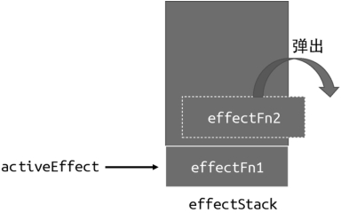

## 4.6 避免无限递归循环

如前文所说，实现一个完善的响应系统要考虑诸多细节。而本节要介绍的无限递归循环就是其中之一，还是举个例子：

```js
const data = { foo: 1 };
const obj = new Proxy(data, {
  /*...*/
});
effect(() => obj.foo++);
```

可以看到，在 effect 注册的副作用函数内有一个自增操作 obj.foo++，导致无限递归地调用自己，会引起栈溢出

我们可以在 trigger 动作发生时增加守卫条件：**如果 trigger 触发执行的副作用函数与当前正在执行的副作用函数相同，则不触发执行**

```js
function trigger(target, key) {
  const depsMap = bucket.get(target);
  if (!depsMap) return;
  const effects = depsMap.get(key);
  const effectsToRun = new Set();
  effects &&
    effects.forEach((effectFn) => {
      // 如果 trigger 触发执行的副作用函数与当前正在执行的副作用函数相同，则不触发执行
      if (effectFn !== activeEffect) {
        // 新增
        effectsToRun.add(effectFn);
      }
    });
  effectsToRun.forEach((effectFn) => effectFn());
  // effects && effects.forEach(effectFn => effectFn())
}
```

## 4.7 可调度性

可调度性是响应系统非常重要的特性。首先我们需要明确什么是可调度性。所谓可调度，指的是当 trigger 动作触发副作用函数重新执行时，有能力决定副作用函数执行的时机、次数以及方式

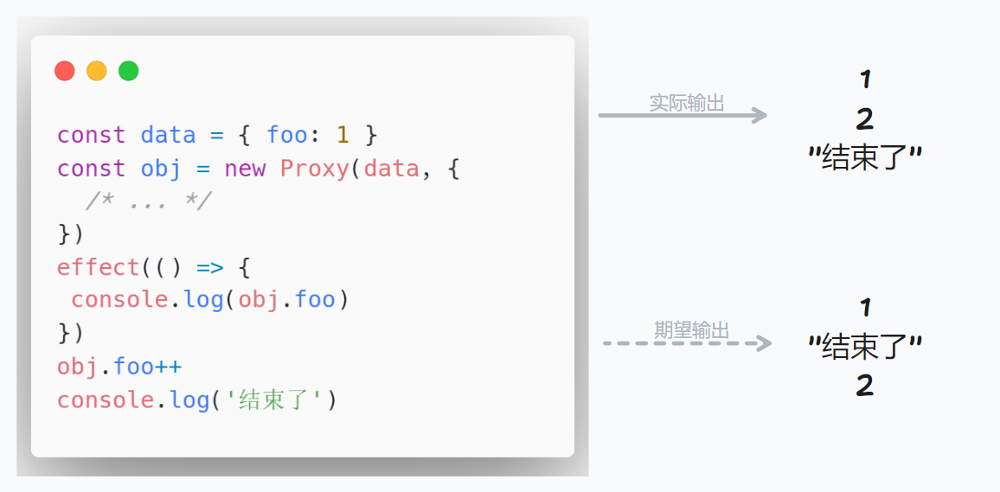

有同学说了：把语句 obj.foo++和语句 console.log('结束了')位置互换即可。

那么有没有什么办法能够在不调整代码的情况下实现需求呢？这时就需要响应系统支持**调度**

### 4.7.1 实现调度功能

我们可以为 effect 函数设计一个选项参数 options，允许用户指定调度器：

```js
effect(
  () => {
    console.log(obj.foo);
  },
  // options
  {
    // 调度器 scheduler 是一个函数
    scheduler(fn) {
      // ...
    },
  }
);
```

用户在调用 effect 函数注册副作用函数时，可以传递第二个参数 options。它是一个对象，其中允许指定 scheduler 调度函数，同时在 effect 函数内部我们需要把 options 选项挂载到对应的副作用函数上：

```js
function effect(fn, options = {}) {
  const effectFn = () => {
    cleanup(effectFn);
    // 当调用 effect 注册副作用函数时，将副作用函数赋值给 activeEffect
    activeEffect = effectFn;
    // 在调用副作用函数之前将当前副作用函数压栈
    effectStack.push(effectFn);
    fn();
    // 在当前副作用函数执行完毕后，将当前副作用函数弹出栈，并把activeEffect 还原为之前的值
    effectStack.pop();
    activeEffect = effectStack[effectStack.length - 1];
  };
  // 将 options 挂载到 effectFn 上
  effectFn.options = options; // 新增
  // activeEffect.deps 用来存储所有与该副作用函数相关的依赖集合
  effectFn.deps = [];
  // 执行副作用函数
  effectFn();
}
```

有了调度函数，我们在 trigger 函数中触发副作用函数重新执行时，就可以直接调用用户传递的调度器函数，从而把控制权交给用户：

```js
function trigger(target, key) {
  const depsMap = bucket.get(target);
  if (!depsMap) return;
  const effects = depsMap.get(key);
  const effectsToRun = new Set();
  effects &&
    effects.forEach((effectFn) => {
      if (effectFn !== activeEffect) {
        effectsToRun.add(effectFn);
      }
    });
  effectsToRun.forEach((effectFn) => {
    // 如果一个副作用函数存在调度器，则调用该调度器，并将副作用函数作为参数传递
    if (effectFn.options.scheduler) {
      // 新增
      effectFn.options.scheduler(effectFn); // 新增
    } else {
      // 否则直接执行副作用函数（之前的默认行为）
      effectFn(); // 新增
    }
  });
}
```

问题来了，如图：

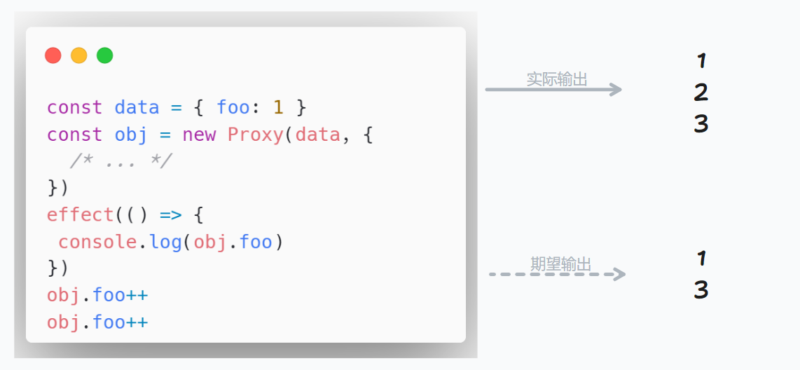

由输出可知，字段 obj.foo 的值一定会从 1 自增到 3，2 只是它的过渡状态。如果我们只关心最终结果而不关心过程，那么执行三次打印操作是多余的

```js
// 定义一个任务队列
const jobQueue = new Set();
// 使用 Promise.resolve() 创建一个 promise 实例，我们用它将一个任务添加到微任务队列
const p = Promise.resolve();
// 一个标志代表是否正在刷新队列
let isFlushing = false;
function flushJob() {
  // 如果队列正在刷新，则什么都不做
  if (isFlushing) return;
  // 设置为 true，代表正在刷新
  isFlushing = true;
  // 在微任务队列中刷新 jobQueue 队列

  p.then(() => {
    jobQueue.forEach((job) => job());
  }).finally(() => {
    // 结束后重置 isFlushing
    isFlushing = false;
  });
}
effect(
  () => {
    console.log(obj.foo);
  },
  {
    scheduler(fn) {
      // 每次调度时，将副作用函数添加到 jobQueue 队列中
      jobQueue.add(fn);
      // 调用 flushJob 刷新队列
      flushJob();
    },
  }
);
obj.foo++;
obj.foo++;
```

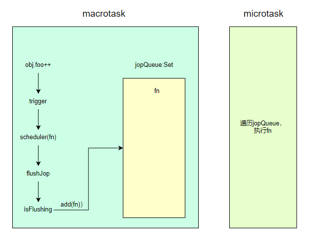

## 4.8 计算属性 computed 与 lazy

### 4.8.1 lazy

在深入讲解计算属性之前，我们需要先来聊聊关于懒执行的 effect，即 lazy 的 effect。这是什么意思呢？举个例子，现在我们所实现的 effect 函数会立即执行传递给它的副作用函数

但在有些场景下，我们并不希望它立即执行，而是希望它在需要的时候才执行，例如计算属性。

我们给 effct 的 options 增加一个 lazy 选项，当 lazy 为 true 时不会立即执行副作用函数。

```js
function effect(fn, options = {}) {
  const effectFn = () => {
    cleanup(effectFn);
    activeEffect = effectFn;
    effectStack.push(effectFn);
    fn();
    effectStack.pop();
    activeEffect = effectStack[effectStack.length - 1];
  };
  effectFn.options = options;
  effectFn.deps = [];
  // 只有非 lazy 的时候，才执行
  if (!options.lazy) {
    // 新增
    // 执行副作用函数
    effectFn();
  }
  // 将副作用函数作为返回值返回
  return effectFn; // 新增
}
```

通过这个判断，我们就实现了让副作用函数不立即执行的功能。但问题是，副作用函数应该什么时候执行呢？通过上面的代码可以看到，我们将副作用函数 effectFn 作为 effect 函数的返回值，这就意味着当调用 effect 函数时，通过其返回值能够拿到对应的副作用函数，这样我们就能手动执行该副作用函数了

```js
const effectFn = effect(
  () => {
    console.log(obj.foo);
  },
  { lazy: true }
);

// 手动执行副作用函数
effectFn();
```

如果仅仅能够手动执行副作用函数，其意义并不大。但如果我们把传递给 effect 的函数看作一个 getter，那么这个 getter 函数可以返回任何值

```js
function effect(fn, options = {}) {
  const effectFn = () => {
    cleanup(effectFn);
    activeEffect = effectFn;
    effectStack.push(effectFn);
    // 将 fn 的执行结果存储到 res 中
    const res = fn(); // 新增
    effectStack.pop();
    activeEffect = effectStack[effectStack.length - 1];
    // 将 res 作为 effectFn 的返回值
    return res; // 新增
  };
  effectFn.options = options;
  effectFn.deps = [];
  if (!options.lazy) {
    effectFn();
  }
  return effectFn;
}
```

通过新增的代码可以看到，传递给 effect 函数的参数 fn 才是真正的副作用函数，而 effectFn 是我们包装后的副作用函数。为了通过 effectFn 得到真正的副作用函数 fn 的执行结果，我们需要将其保存到 res 变量中，然后将其作为 effectFn 函数的返回值。

现在我们已经能够实现懒执行的副作用函数，并且能够拿到副作用函数的执行结果了，接下来就可以实现计算属性了

### 4.8.2 实现计算属性

```js
function computed(getter) {
  // 把 getter 作为副作用函数，创建一个 lazy 的 effect
  const effectFn = effect(getter, {
    lazy: true,
  });
  const obj = {
    // 当读取 value 时才执行 effectFn
    get value() {
      return effectFn();
    },
  };
  return obj;
}

const data = { foo: 1, bar: 2 };
const obj = new Proxy(data, {
  /* ... */
});
const sumRes = computed(() => obj.foo + obj.bar);
console.log(sumRes.value); //
```

可以看到它能够正确地工作。不过现在我们实现的计算属性只做到了懒计算，也就是说，只有当你真正读取 sumRes.value 的值时，它才会进行计算并得到值。但是还做不到对值进行缓存，即假如我们多次访问 sumRes.value 的值，会导致 effectFn 进行多次计算，即使 obj.foo 和 obj.bar 的值本身并没有变化

为了解决这个问题，就需要我们在实现 computed 函数时，添加对值进行缓存的功能，如以下代码所示：

计算属性懒计算
计算属性缓存
计算属性值的响应性

```js
function computed(getter) {
  // value 用来缓存上一次计算的值
  let value;
  // dirty 标志，用来标识是否需要重新计算值，为 true 则意味着“脏”，需要计算
  let dirty = true;
  const effectFn = effect(getter, {
    lazy: true,
  });
  const obj = {
    get value() {
      // 只有“脏”时才计算值，并将得到的值缓存到 value 中
      if (dirty) {
        value = effectFn();
        // 将 dirty 设置为 false，下一次访问直接使用缓存到 value 中的值
        dirty = false;
      }
      return value;
    },
  };

  return obj;
}
```

effect 的副作用函数中读取了 computed 的值，如果修改了其依赖，计算属性发生变化就会触发重新
渲染，但是如果尝试运行上面这段代码，并不会触发副作用函数的渲染

当读取计算属性的值时，我们可以手动调用 track 函数进行追踪；当计算属性依赖的响应式数据发生变化时，我们可以手动调用 trigger 函数触发响应：

```js
function computed(getter) {
  let value;
  let dirty = true;
  const effectFn = effect(getter, {
    lazy: true,
    scheduler() {
      if (!dirty) {
        dirty = true;
        // 当计算属性依赖的响应式数据变化时，手动调用 trigger 函数触发响应
        trigger(obj, "value");
      }
    },
  });
  const obj = {
    get value() {
      if (dirty) {
        value = effectFn();
        dirty = false;
      }
      // 当读取 value 时，手动调用 track 函数进行追踪
      track(obj, "value");
      return value;
    },
  };

  return obj;
}
```

## 4.9 watch 的实现原理

所谓 watch，其本质就是观测一个响应式数据，当数据发生变化时通知并执行相应的回调函数
实际上，watch 的实现本质上就是利用了 effect 以及 options.scheduler 选项，如以下代码所示

```js
effect(
  () => {
    console.log(obj.foo);
  },
  {
    scheduler() {
      // 当 obj.foo 的值变化时，会执行 scheduler 调度函数
    },
  }
);
```

在一个副作用函数中访问响应式数据 obj.foo，通过前面的介绍，我们知道这会在副作用函数与响应式数据之间建立联系，当响应式数据变化时，会触发副作用函数重新执行。但有一个例外，即如果副作用函数存在 scheduler 选项，当响应式数据发生变化时，会触发 scheduler 调度函数执行，而非直接触发副作用函数执行。从这个角度来看，其实 scheduler 调度函数就相当于一个回调函数，而 watch 的实现就是利用了这个特点。下面是最简单的 watch 函数的实现：

```js
// watch 函数接收两个参数，source 是响应式数据，cb 是回调函数
function watch(source, cb) {
  effect(
    // 触发读取操作，从而建立联系
    () => source.foo,
    {
      scheduler() {
        // 当数据变化时，调用回调函数 cb
        cb();
      },
    }
  );
}
```

上面这段代码能正常工作，但是我们注意到在 watch 函数的实现中，硬编码了对 source.foo 的读取操作。换句话说，现在只能观测 obj.foo 的改变。为了让 watch 函数具有通用性，我们需要一个封装一个通用的读取操作

```js
function watch(source, cb) {
  effect(
    // 调用 traverse 递归地读取
    () => traverse(source),
    {
      scheduler() {
        // 当数据变化时，调用回调函数 cb
        cb();
      },
    }
  );
}
function traverse(value, seen = new Set()) {
  // 如果要读取的数据是原始值，或者已经被读取过了，那么什么都不做
  if (typeof value !== "object" || value === null || seen.has(value)) return;
  // 将数据添加到 seen 中，代表遍历地读取过了，避免循环引用引起的死循环
  seen.add(value);
  // 暂时不考虑数组等其他结构

  // 假设 value 就是一个对象，使用 for...in 读取对象的每一个值，并递归地调用 traverse 进行处理
  for (const k in value) {
    traverse(value[k], seen);
  }
  return value;
}
```

watch 函数除了可以观测响应式数据，还可以接收一个 getter 函数：

```js
function watch(source, cb) {
  // 定义 getter
  let getter;
  // 如果 source 是函数，说明用户传递的是 getter，所以直接把 source 赋值给 getter
  if (typeof source === "function") {
    getter = source;
  } else {
    // 否则按照原来的实现调用 traverse 递归地读取
    getter = () => traverse(source);
  }

  effect(
    // 执行 getter
    () => getter(),
    {
      scheduler() {
        cb();
      },
    }
  );
}

//调用watch函数
watch(
  // getter 函数
  () => obj.foo,
  // 回调函数
  () => {
    console.log("obj.foo 的值变了");
  }
);
```

那么如何获得新值与旧值呢？这需要充分利用 effect 函数的 lazy 选项，如以下代码所示

```js
function watch(source, cb) {
  let getter;
  if (typeof source === "function") {
    getter = source;
  } else {
    getter = () => traverse(source);
  }
  // 定义旧值与新值
  let oldValue, newValue;
  // 使用 effect 注册副作用函数时，开启 lazy 选项，并把返回值存储到effectFn 中以便后续手动调用
  const effectFn = effect(() => getter(), {
    lazy: true,
    scheduler() {
      // 在 scheduler 中重新执行副作用函数，得到的是新值
      newValue = effectFn();
      // 将旧值和新值作为回调函数的参数
      cb(newValue, oldValue);
      // 更新旧值，不然下一次会得到错误的旧值
      oldValue = newValue;
    },
  });
  // 手动调用副作用函数，拿到的值就是旧值
  oldValue = effectFn();
}
```

## 4.10 立即执行的 watch 与回调执行时机

上一节中我们介绍了 watch 的基本实现。在这个过程中我们认识到，watch 的本质其实是对 effect 的二次封装。本节我们继续讨论关于 watch 的两个特性：一个是立即执行的回调函数，另一个是回调函数的执行时机

默认情况下，一个 watch 的回调只会在响应式数据发生变化时才执行,在 Vue.js 中可以通过选项参数 immediate 来指定回调是否需要立即执行：

```js
watch(
  obj,
  () => {
    console.log("变化了");
  },
  {
    // 回调函数会在 watch 创建时立即执行一次
    immediate: true,
  }
);
```

当 immediate 选项存在并且为 true 时，回调函数会在该 watch 创建时立刻执行一次。仔细思考就会发现，回调函数的立即执行与后续执行本质上没有任何差别，所以我们可以把 scheduler 调度函数封装为一个通用函数，分别在初始化和变更时执行它，如以下代码所示：

```js
function watch(source, cb, options = {}) {
  let getter;
  if (typeof source === "function") {
    getter = source05;
  } else {
    getter = () => traverse(source);
  }
  let oldValue, newValue;
  // 提取 scheduler 调度函数为一个独立的 job 函数
  const job = () => {
    newValue = effectFn();
    cb(newValue, oldValue);
    oldValue = newValue;
  };
  const effectFn = effect(
    // 执行 getter
    () => getter(),
    {
      lazy: true,
      // 使用 job 函数作为调度器函数
      scheduler: job,
    }
  );
  if (options.immediate) {
    // 当 immediate 为 true 时立即执行 job，从而触发回调执行
    job();
  } else {
    oldValue = effectFn();
  }
}
```

flush 本质上是在指定调度函数的执行时机。前文讲解过如何在微任务队列中执行调度函数 scheduler，这与 flush 的功能相同。当 flush 的值为'post'时，代表调度函数需要将副作用函数放到一个微任务队列中，并等待 DOM 更新结束后再执行，我们可以用如下代码进行模拟

```js
function watch(source, cb, options = {}) {
  let getter;
  if (typeof source === "function") {
    getter = source;
  } else {
    getter = () => traverse(source);
  }
  let oldValue, newValue;

  const job = () => {
    newValue = effectFn();
    cb(newValue, oldValue);
    oldValue = newValue;
  };
  const effectFn = effect(
    // 执行 getter
    () => getter(),
    {
      lazy: true,
      scheduler: () => {
        // 在调度函数中判断 flush 是否为 'post'，如果是，将其放到微任务队列中执行
        if (options.flush === "post") {
          const p = Promise.resolve();
          p.then(job);
        } else {
          job();
        }
      },
    }
  );
  if (options.immediate) {
    job();
  } else {
    oldValue = effectFn();
  }
}
```

我们修改了调度器函数 scheduler 的实现方式，在调度器函数内检测 options.flush 的值是否为 post，如果是，则将 job 函数放到微任务队列中，从而实现异步延迟执行；否则直接执行 job 函数，这本质上相当于'sync'的实现机制，即同步执行。对于 options.flush 的值为'pre'的情况，我们暂时还没有办法模拟，因为这涉及组件的更新时机，其中'pre'和'post'原本的语义指的就是组件更新前和更新后，不过这并不影响我们理解如何控制回调函数的更新时机

## 4.11 过期的副作用

```js
let finalData;
watch(obj, async () => {
  // 发送并等待网络请求
  const res = await fetch("/path/to/request");
  // 将请求结果赋值给 data
  finalData = res;
});
```

观察上面的代码，乍一看似乎没什么问题。但仔细思考会发现这段代码会发生竞态问题。

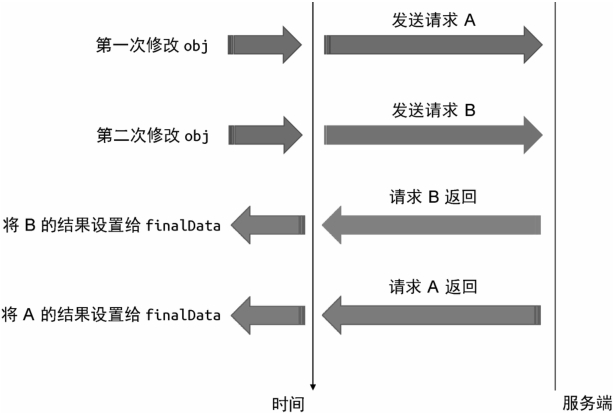

在 Vue.js 中，watch 函数的回调函数接收第三个参数 onInvalidate，它是一个函数，类似于事件监听器，我们可以使用 onInvalidate 函数注册一个回调，这个回调函数会在当前副作用函数过期时执行

```js
watch(obj, async (newValue, oldValue, onInvalidate) => {
  // 定义一个标志，代表当前副作用函数是否过期，默认为 false，代表没有过期
  let expired = false;
  // 调用 onInvalidate() 函数注册一个过期回调
  onInvalidate(() => {
    // 当过期时，将 expired 设置为 true
    expired = true;
  });
  // 发送网络请求
  const res = await fetch("/path/to/request");
  // 只有当该副作用函数的执行没有过期时，才会执行后续操作。
  if (!expired) {
    finalData = res;
  }
});
```

如上面的代码所示，在发送请求之前，我们定义了 expired 标志变量，用来标识当前副作用函数的执行是否过期；接着调用 onInvalidate 函数注册了一个过期回调，当该副作用函数的执行过期时将 expired 标志变量设置为 true；最后只有当没有过期时才采用请求结果，这样就可以有效地避免上述问题了。那么 Vue.js 是怎么做到的呢？换句话说，onInvalidate 的原理是什么呢？其实很简单，在 watch 内部每次检测到变更后，在副作用函数重新执行之前，会先调用我们通过 onInvalidate 函数注册的过期回调，仅此而已，如以下代码所示

```js
function watch(source, cb, options = {}) {
  let getter;
  if (typeof source === "function") {
    getter = source;
  } else {
    getter = () => traverse(source);
  }
  let oldValue, newValue;
  // cleanup 用来存储用户注册的过期回调
  let cleanup;
  // 定义 onInvalidate 函数
  function onInvalidate(fn) {
    // 将过期回调存储到 cleanup 中
    cleanup = fn;
  }
  const job = () => {
    newValue = effectFn();
    // 在调用回调函数 cb 之前，先调用过期回调
    if (cleanup) {
      cleanup();
    }
    // 将 onInvalidate 作为回调函数的第三个参数，以便用户使用
    cb(newValue, oldValue, onInvalidate);
    oldValue = newValue;
  };
  const effectFn = effect(
    // 执行 getter
    () => getter(),
    {
      lazy: true,

      scheduler: () => {
        if (options.flush === "post") {
          const p = Promise.resolve();
          p.then(job);
        } else {
          job();
        }
      },
    }
  );
  if (options.immediate) {
    job();
  } else {
    oldValue = effectFn();
  }
}
```

在这段代码中，我们首先定义了 cleanup 变量，这个变量用来存储用户通过 onInvalidate 函数注册的过期回调。可以看到 onInvalidate 函数的实现非常简单，只是把过期回调赋值给了 cleanup 变量。这里的关键点在 job 函数内，每次执行回调函数 cb 之前，先检查是否存在过期回调，如果存在，则执行过期回调函数 cleanup。最后我们把 onInvalidate 函数作为回调函数的第三个参数传递给 cb，以便用户使用

```js
watch(obj, async (newValue, oldValue, onInvalidate) => {
  let expired = false;
  onInvalidate(() => {
    expired = true;
  });
  const res = await fetch("/path/to/request");
  if (!expired) {
    finalData = res;
  }
});
// 第一次修改
obj.foo++;
setTimeout(() => {
  // 200ms 后做第二次修改
  obj.foo++;
}, 200);
```

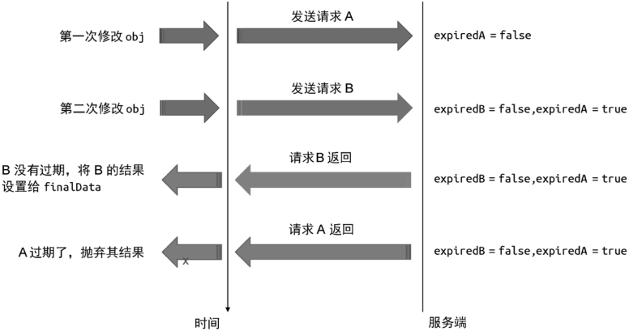
