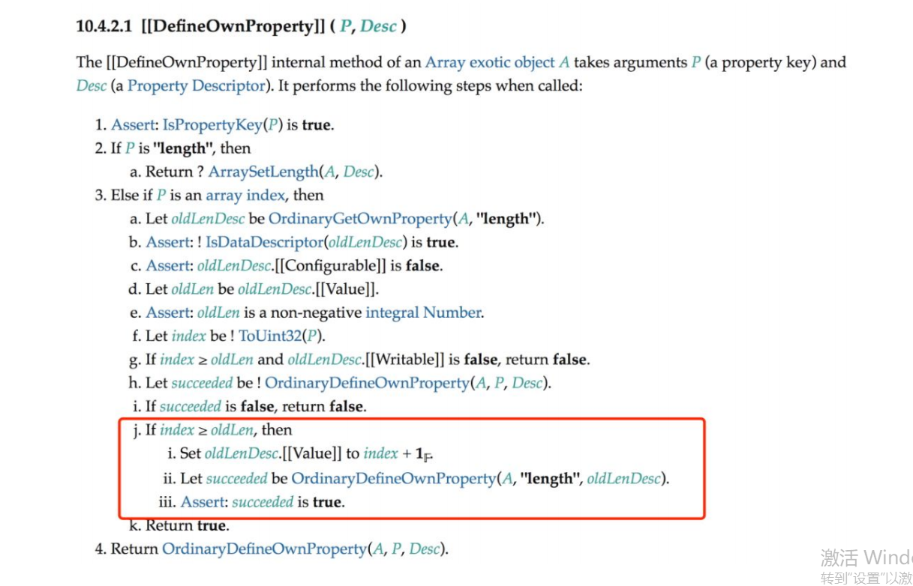

# 第五章 非原始值的响应式方案

## 本章内容

- 理解 Proxy 和 Reflect
- JavaScript 对象及 Proxy 的工作原理
- 如何代理 Object
- 合理地触发响应
- 浅响应与深响应
- 只读和浅只读
- 代理数组
- 代理 Set 和 Map

## 5.1 理解 Proxy 和 Reflect

### Proxy

> 什么是 Proxy 呢？简单地说，使用 Proxy 可以创建一个代理对象。它能够实现对其他对象的代理，这里的关键词是其他对象，也就是说，Proxy 只能代理对象，无法代理非对象值，例如字符串、布尔值等。那么，代理指的是什么呢？所谓代理，指的是对一个对象基本语义的代理。它允许我们拦截并重新定义对一个对象的基本操作。这句话的关键词比较多，我们逐一解释:

什么是基本语义？给出一个对象 obj，可以对它进行一些操作，例如读取属性值、设置属性值：

```js
obj.foo; // 读取属性 foo 的值
obj.foo++; // 读取和设置属性 foo 的值
```

类似这种读取、设置属性值的操作，就属于基本语义的操作，即基本操作。既然是基本操作，那么它就可以使用 Proxy 拦截：

```js
const p = new Proxy(obj, {
  // 拦截读取属性操作
  get() {
    /*...*/
  },
  // 拦截设置属性操作
  set() {
    /*...*/
  },
});
```

如以上代码所示，Proxy 构造函数接收两个参数。第一个参数是被代理的对象，第二个参数也是一个对象，这个对象是一组夹子（trap）。其中 get 函数用来拦截读取操作，set 函数用来拦截设置操作。

在 JavaScript 的世界里，万物皆对象。例如一个函数也是一个对象，所以调用函数也是对一个对象的基本操作：

```js
const fn = (name) => {
  console.log("我是：", name);
};
// 调用函数是对对象的基本操作
fn();
```

因此，我们可以用 Proxy 来拦截函数的调用操作，这里我们使用 apply 拦截函数的调用：

```js
const p2 = new Proxy(fn, {
  // 使用 apply 拦截函数调用
  apply(target, thisArg, argArray) {
    target.call(thisArg, ...argArray);
  },
});

p2("hcy"); // 输出：'我是：hcy'
```

上面两个例子说明了什么是基本操作。Proxy 只能够拦截对一个对象的基本操作。那么，什么是非基本操作呢？其实调用对象下的方法就是典型的非基本操作，我们叫它复合操作：

```js
obj.fn();
```

实际上，调用一个对象下的方法，是由两个基本语义组成的，第一个基本语义是 get，即先通过 get 操作得到 obj.fn 属性。第二个基本语义是函数调用，即通过 get 得到 obj.fn 的值后再调用它，也就是我们上面说到的 apply。

### Reflect

Reflect 是一个全局对象，其下有许多方法，例如：

```js
Reflect.get();
Reflect.set();
Reflect.apply();
```

Reflect 下的方法与 Proxy 的拦截器方法名字相同，其实这不是偶然。任何在 Proxy 的拦截器中能够找到的方法，都能够在 Reflect 中找到同名函数，那么这些函数的作用是什么呢？其实它们的作用一点儿都不神秘。拿 Reflect.get 函数来说，它的功能就是提供了访问一个对象属性的默认行为，例如下面两个操作是等价的：

```js
const obj = { foo: 1 };
// 直接读取
console.log(obj.foo); // 1
// 使用 Reflect.get 读取
console.log(Reflect.get(obj, "foo")); // 1
```

既然操作等价，那么它存在的意义是什么呢？实际上 Reflect.get 函数还能接收第三个参数，即指定接收者 receiver，你可以把它理解为函数调用过程中的 this，例如：

```js
const obj = { foo: 1 };
console.log(Reflect.get(obj, "foo", { foo: 2 })); // 输出的是 2 而不是 1
```

在这段代码中，我们指定第三个参数 receiver 为一个对象 {foo: 2 }，这时读取到的值是 receiver 对象的 foo 属性值。实际上，Reflect.\* 方法还有很多其他方面的意义，但这里我们只关心并讨论这一点，因为它与响应式数据的实现密切相关。为了说明问题，回顾一下在上一节中实现响应式数据的代码：

```js
const obj = { foo: 1 };

const p = new Proxy(obj, {
  get(target, key) {
    track(target, key);
    // 注意，这里我们没有使用 Reflect.get 完成读取
    return target[key];
  },
  set(target, key, newVal) {
    // 这里同样没有使用 Reflect.set 完成设置
    target[key] = newVal;
    trigger(target, key);
  },
});
```

这是上一章中用来实现响应式数据的最基本的代码。在 get 和 set 拦截函数中，我们都是直接使用原始对象 target 来完成对属性的读取和设置操作的，其中原始对象 target 就是上述代码中的 obj 对象。

那么这段代码有什么问题吗？我们借助 effect 让问题暴露出来。首先，我们修改一下 obj 对象，为它添加 bar 属性：

```js
const obj = {
  foo: 1,
  get bar() {
    return this.foo;
  },
};
```

可以看到，bar 属性是一个访问器属性，它返回了 this.foo 属性的值。接着，我们在 effect 副作用函数中通过代理对象 p 访问 bar 属性：

```js
effect(() => {
  console.log(p.bar); // 1
});
```

我们来分析一下这个过程发生了什么。当 effect 注册的副作用函数执行时，会读取 p.bar 属性，它发现 p.bar 是一个访问器属性，因此执行 getter 函数。由于在 getter 函数中通过 this.foo 读取了 foo 属性值，因此我们认为副作用函数与属性 foo 之间也会建立联系。当我们修改 p.foo 的值时应该能够触发响应，使得副作用函数重新执行才对。然而实际并非如此，当我们尝试修改 p.foo 的值时：

```js
p.foo++;
```

副作用函数并没有重新执行，问题出在哪里呢？实际上，问题就出在 bar 属性的访问器函数 getter 里：

```js
const obj = {
  foo: 1,
  get bar() {
    // 这里的 this 指向的是谁？
    return this.foo;
  },
};
```

当我们使用 this.foo 读取 foo 属性值时，这里的 this 指向的是谁呢？我们回顾一下整个流程。首先，我们通过代理对象 p 访问 p.bar，这会触发代理对象的 get 拦截函数执行：

```js
const p = new Proxy(obj, {
  get(target, key) {
    track(target, key);
    // 注意，这里我们没有使用 Reflect.get 完成读取
    return target[key];
  },
  // 省略部分代码
});
```

在 get 拦截函数内，通过 target[key] 返回属性值。其中 target 是原始对象 obj，而 key 就是字符串 'bar'，所以 target[key] 相当于 obj.bar。因此，当我们使用 p.bar 访问 bar 属性时，它的 getter 函数内的 this 指向的其实是原始对象 obj，这说明我们最终访问的其实是 obj.foo。很显然，在副作用函数内通过原始对象访问它的某个属性是不会建立响应联系的，这等价于：

```js
effect(() => {
  // obj 是原始数据，不是代理对象，这样的访问不能够建立响应联系
  obj.foo;
});
```

因为这样做不会建立响应联系，所以出现了无法触发响应的问题。那么这个问题应该如何解决呢？这时 Reflect.get 函数就派上用场了。先给出解决问题的代码：

```js
const p = new Proxy(obj, {
  // 拦截读取操作，接收第三个参数 receiver
  get(target, key, receiver) {
    track(target, key);
    // 使用 Reflect.get 返回读取到的属性值
    return Reflect.get(target, key, receiver);
  },
  // 省略部分代码
});
```

如上面的代码所示，代理对象的 get 拦截函数接收第三个参数 receiver，它代表谁在读取属性，例如：

```js
p.bar; // 代理对象 p 在读取 bar
```

当我们使用代理对象 p 访问 bar 属性时，那么 receiver 就是 p，你可以把它简单地理解为函数调用中的 this。接着关键的一步发生了，我们使用 Reflect.get(target, key, receiver) 代替之前的 target[key]，这里的关键点就是第三个参数 receiver。我们已经知道它就是代理对象 p，所以访问器属性 bar 的 getter 函数内的 this 指向代理对象 p：

```js
const obj = {
  foo: 1,
  get bar() {
    // 现在这里的 this 为代理对象 p
    return this.foo;
  },
};
```

可以看到，this 由原始对象 obj 变成了代理对象 p。很显然，这会在副作用函数与响应式数据之间建立响应联系，从而达到依赖收集的效果。如果此时再对 p.foo 进行自增操作，会发现已经能够触发副作用函数重新执行了。
[△ 运行代码](https://code.juejin.cn/pen/7350559590141935642)
正是基于上述原因，后文讲解中将统一使用 Reflect.\* 方法。

## 5.2 JavaScript 对象及 Proxy 的工作原理

在 JavaScript 中有两种对象，其中一种叫作常规对象（ordinary object），另一种叫作异质对象（exotic object）。这两种对象包了 JavaScript 世界中的所有对象，任何不属于常规对象的对象都是异质对象。那么到底什么是常规对象，什么是异质对象呢？这需要我们先了解对象的内部方法和内部槽。

在 JavaScript 中，函数其实也是对象。假设给出一个对象 obj，**如何区分它是普通对象还是函数呢？** 实际上，在 JavaScript 中，对象的实际语义是由对象的内部方法（internal method）指定的。所谓内部方法，指的是当我们对一个对象进行操作时在引擎内部调用的方法，这些方法对于 JavaScript 使用者来说是不可见的。当我们访问对象属性时，引擎内部会调用 [[Get]] 这个内部方法来读取属性值。当然，一个对象不仅部署了 [[Get]] 这个内部方法，表 5-1 列出了规范要求的所有必要的内部方法 。

- 表 5-1 对象必要的内部方法
  | 内部方法 | 签名 | 描述 |
  |:------:|:----:|:----:|
  [[GetPrototypeOf]] | ( ) → Object/Null |查明为该对象提供继承属性的对象，null 代表没有继承属性
  [[SetPrototypeOf]] | (Object/Null) → Boolean | 将该对象与提供继承属性的另一个对象相关联。传递 null 表示没有继承属性，返回 true 表示操作成功完成，返回 false 表示操作失败
  [[IsExtensible]] | ( ) → Boolean |查明是否允许向该对象添加其他属性
  [[PreventExtensions]] | ( ) → Boolean|控制能否向该对象添加新属性。如果操作成功则返回 true，如果操作失败则返回 false
  [[GetOwnProperty]] | (propertyKey) → Undefined/Property Descriptor | 返回该对象自身属性的描述符，其键为 propertyKey，如果不存在这样的属性，则返回 undefined
  [[DefineOwnProperty]] | (propertyKey, PropertyDescriptor) → Boolean | 创建或更改自己的属性，其键为 propertyKey，以具有由 PropertyDescriptor 描述的状态。如果该属性已成功创建或更新，则返回 true；如果无法创建或更新该属性，则返回 false
  [[HasProperty]] | (propertyKey) → Boolean | 返回一个布尔值，指示该对象是否已经拥有键为 propertyKey 的自己的或继承的属性
  [[Get]] | (propertyKey,Receiver) → any | 从该对象返回键为 propertyKey 的属性的值。如果必须运行 ECMAScript 代码来检索属性值，则在运行代码时使用 Receiver 作为 this 值
  [[Set]] | (propertyKey, value, Receiver) →Boolean | 将键值为 propertyKey 的属性的值设置为 value。如果必须运行 ECMAScript 代码来设置属性值，则在运行代码时使用 Receiver 作为 this 值。如果成功设置了属性值，则返回 true；如果无法设置，则返回 false
  [[Delete]] | (propertyKey) → Boolean | 从该对象中删除属于自身的键为 propertyKey 的属性。如果该属性未被删除并且仍然存在，则返回 false；如果该属性已被删除或不存在，则返回 true
  [[OwnPropertyKeys]] | ( ) → List of propertyKey | 返回一个 List，其元素都是对象自身的属性键

由表 5-1 可知，包括 [[Get]] 在内，一个对象必须部署 11 个必要的内部方法。除了表 5-1 所列的内部方法之外，还有两个额外的必要内部方法 ：[[Call]] 和 [[Construct]]，如表 5-2 所示。

- 表 5-2 额外的必要内部方法
  | 内部方法 | 签名 | 描述 |
  |:------:|:----:|:----:|
  [[Call]] | (any, a List of any) → any | 将运行的代码与 this 对象关联。由函数调用触发。该内部方法的参数是一个 this 值和参数列表
  [[Construct]] | (a List of any, Object)→ Object | 创建一个对象。通过 new 运算符或 super 调用触发。该内部方法的第一个参数是一个 List，该 List 的元素是构造函数调用或 super 调用的参数，第二个参数是最初应用 new 运算符的对象。实现该内部方法的对象称为构造函数

**如何区分它是普通对象还是函数呢？**

> 通过内部方法和内部槽来区分对象，例如函数对象会部署内部方法 [[Call]]，而普通对象则不会。

内部方法具有多态性，这是什么意思呢？这类似于面向对象里多态的概念。这就是说，不同类型的对象可能部署了相同的内部方法，却具有不同的逻辑。例如，普通对象和 Proxy 对象都部署了[[Get]] 这个内部方法，但它们的逻辑是不同的。了解了内部方法，就可以解释什么是常规对象，什么是异质对象了。满足以下三点要求的对象就是常规对象：

- 对于表 5-1 列出的内部方法，必须使用 ECMA 规范 10.1.x 节给出的定义实现；
- 对于内部方法 [[Call]]，必须使用 ECMA 规范 10.2.1 节给出的定义实现；
- 对于内部方法 [[Construct]]，必须使用 ECMA 规范 10.2.2 节给出的定义实现

而所有不符合这三点要求的对象都是异质对象。例如，由于 Proxy 对象的内部方法 [[Get]] 没有使用 ECMA 规范的 10.1.8 节给出的定义实现，所以 Proxy 是一个异质对象。

现在我们对 JavaScript 中的对象有了更加深入的理解。接下来，我们就具体看看 Proxy 对象。既然 Proxy 也是对象，那么它本身也部署了上述必要的内部方法，当我们通过代理对象访问属性值时：

```JS
const p = new Proxy(obj, {/* ... */})
p.foo
```

实际上，引擎会调用部署在对象 p 上的内部方法 [[Get]]。到这一步，其实代理对象和普通对象没有太大区别。它们的区别在于对于内部方法 [[Get]] 的实现，这里就体现了内部方法的多态性，即不同的对象部署相同的内部方法，但它们的行为可能不同。
如果在创建代理对象时没有指定对应的拦截函数，例如没有指定 get() 拦截函数，那么当我们通过代理对象访问属性值时，代理对象的内部方法 [[Get]] 会调用原始对象的内部方法 [[Get]] 来获取属性值，这其实就是代理透明性质。

现在相信你已经明白了，创建代理对象时指定的拦截函数，实际上是用来自定义代理对象本身的内部方法和行为的，而不是用来指定被代理对象的内部方法和行为的。表 5-3 列出了 Proxy 对象部署的所有内部方法以及用来自定义内部方法和行为的拦截函数名字 3。

- 表 5-3 Proxy 对象部署的所有内部方法
  | 内部方法 | 处理器函数 |
  |:------:|:-----:|
  [[GetPrototypeOf]] | getPrototypeOf
  [[SetPrototypeOf]] | setPrototypeOf
  [[IsExtensible]] | isExtensible
  [[PreventExtensions]] | preventExtensions
  [[GetOwnProperty]] | getOwnPropertyDescriptor
  [[DefineOwnProperty]] | defineProperty
  [[HasProperty]] | has
  [[Get]] | get
  [[Set]] | set
  [[Delete]] | deleteProperty
  [[OwnPropertyKeys]] | ownKeys
  [[Call]] | apply
  [[Construct]] | construct

当然，其中 [[Call]] 和 [[Construct]] 这两个内部方法只有当被代理的对象是函数和构造函数时才会部署。

由表 5-3 可知，当我们要拦截删除属性操作时，可以使用 deleteProperty 拦截函数实现：

```JS
const obj = { foo: 1 }
const p = new Proxy(obj, {
  deleteProperty(target, key) {
    return Reflect.deleteProperty(target, key)
  }
})
console.log(p.foo) // 1
delete p.foo
console.log(p.foo) // 未定义
```

这里需要强调的是，deleteProperty 实现的是代理对象 p 的内部方法和行为，所以为了删除被代理对象上的属性值，我们需要使用 Reflect.deleteProperty(target, key) 来完成。

## 5.3 如何代理 Object

> 从本节开始，我们将着手实现响应式数据。前面我们使用 get 拦截函数去拦截对属性的读取操作。下面列出了对一个普通对象的所有可能的读取操作。

- 访问属性：obj.foo。
- 判断对象或原型上是否存在给定的 key：key in obj。
- 使用 for...in 循环遍历对象：for (const key in obj){}。

### 5.3.1 首先是对于属性的读取，

> 例如 obj.foo，我们知道这可以通过 get 拦截函数实现：

```JS
const obj = { foo: 1 }
const p = new Proxy(obj, {
  get(target, key, receiver) {
    // 建立联系
    track(target, key)
    // 返回属性值
    return Reflect.get(target, key, receiver)
  },
})
```

### 5.3.2 对于 in 操作拦截

> 通过 has 拦截函数实现对 in 操作符的代理：

```JS
const obj = { foo: 1 }
const p = new Proxy(obj, {
  has(target, key) {
  track(target, key)
    return Reflect.has(target, key)
  }
})

// 当我们在副作用函数中通过 in 操作符操作响应式数据时，就能够建立依赖关系：
effect(() => {
  'foo' in p // 将会建立依赖关系
})
```

### 5.3.3 拦截 for...in 循环

> 使用 ownKeys 拦截函数来拦截 Reflect.ownKeys 操作：

```JS
const obj = { foo: 1 }
const ITERATE_KEY = Symbol()

const p = new Proxy(obj, {
  ownKeys(target) {
    // 将副作用函数与 ITERATE_KEY 关联
    track(target, ITERATE_KEY)
    return Reflect.ownKeys(target)
  }
})

effect(() => {
  // for...in 循环
  for (const key in p) {
    console.log(key) // foo
  }
})
```

## 5.4 合理地触发响应

### 5.4.1 值不变触发响应

当值没有发生变化时，应该不需要触发响应才对：

```JS
const obj = { foo: 1 }
const p = new Proxy(obj, { /* ... */ })

effect(() => {
  console.log(p.foo)
})

// 设置 p.foo 的值，但值没有变化
p.foo = 1
```

为了满足需求，我们需要修改 set 拦截函数的代码，在调用 trigger 函数触发响应之前，需要检查值是否真的发生了变化：

```JS
const p = new Proxy(obj, {
  set(target, key, newVal, receiver) {
    // 先获取旧值
    const oldVal = target[key]
    const res = Reflect.set(target, key, newVal, receiver)
    // 比较新值与旧值，只要当不全等的时候才触发响应
    if (oldVal !== newVal) {
      trigger(target, key)
    }
   return res
  },
})
```

然而，仅仅进行全等比较是有缺陷的，这体现在对 NaN 的处理上。我们知道 NaN 与 NaN 进行全等比较总会得到 false：

```JS
NaN === NaN // false
NaN !== NaN // true
```

为了解决这个问题，我们需要再加一个条件，即在新值和旧值不全等的情况下，要保证它们都不是 NaN：

```JS
const p = new Proxy(obj, {
  set(target, key, newVal, receiver) {
    // 先获取旧值
    const oldVal = target[key]
    const res = Reflect.set(target, key, newVal, receiver)
    // 比较新值与旧值，只有当它们不全等，并且不都是 NaN 的时候才触发响应
    if (oldVal !== newVal && (oldVal === oldVal || newVal === newVal)) {
      trigger(target, key)
    }
   return res
  },
})
```

[△ 运行代码](https://code.juejin.cn/pen/7350962110827855872)

### 5.4.2 原型继承属性触发响应

但想要合理地触发响应，仅仅处理关于 NaN 的问题还不够。接下来，我们讨论一种从原型上继承属性的情况。

```JS
function reactive(obj) {
  return new Proxy(obj, {
    // 省略前文讲解的拦截函数
  })
}

const obj = {}
const proto = { bar: 1 }
const child = reactive(obj)
const parent = reactive(proto)
// 使用 parent 作为 child 的原型
Object.setPrototypeOf(child, parent)
effect(() => {
  console.log(child.bar) // 1
})

// 修改 child.bar 的值
child.bar = 2 // 会导致副作用函数重新执行两次
```

我们定义了空对象 obj 和对象 proto，分别为二者创建了对应的响应式数据 child 和 parent，并且使用 Object.setPrototypeOf 方法将 parent 设置为 child 的原型。接着，在副作用函数内访问 child.bar 的值。从代码中可以看出，child 本身并没有 bar 属性，因此当访问 child.bar 时，值是从原型上继承而来的。但无论如何，既然 child 是响应式数据，那么它与副作用函数之间就会建立联系，因此当我们执行 child.bar = 2 时，期望副作用函数会重新执行。**但如果你尝试运行上面的代码，会发现副作用函数不仅执行了，还执行了两次，这会造成不必要的更新。**

为了搞清楚问题的原因，我们需要逐步分析整个过程。

- 当在副作用函数中读取 child.bar 的值时，会触发 child 代理对象的 get 拦截函数。我们知道，在拦截函数内是使用 Reflect.get(target,key, receiver) 来得到最终结果的，这其实是实现了通过 obj.bar 来访问属性值的默认行为。也就是说，引擎内部是通过调用 obj 对象所部署的 [[Get]] 内部方法来得到最终结果的
- 如果设置的属性不存在于对象上，那么会取得其原型，并调用原型的 [[Set]] 方法，也就是 parent 的 [[Set]] 内部方法。由于 parent 是代理对象，所以这就相当于执行了它的 set 拦截函数。换句话说，虽然我们操作的是 child.bar，但这也会导致 parent 代理对象的 set 拦截函数被执行。前面我们分析过，当读取 child.bar 的值时，副作用函数不仅会被 child.bar 收集，也会被 parent.bar 收集。**所以当 parent 代理对象的 set 拦截函数执行时，就会触发副作用函数重新执行，**

两次更新是由于 set 拦截函数被触发了两次导致的，所以只要我们能够在 set 拦截函数内区分这两次更新就可以了。当我们设置 child.bar 的值时，会执行 child 代理对象的 set 拦截函数：

```JS
// child 的 set 拦截函数
set(target, key, value, receiver) {
  // target 是原始对象 obj
  // receiver 是代理对象 child
}
```

此时的 target 是原始对象 obj，receiver 是代理对象 child，我们发现 **receiver 其实就是 target 的代理对象。**

但由于 obj 上不存在 bar 属性，所以会取得 obj 的原型 parent，并执行 parent 代理对象的 set 拦截函数：

```JS
// parent 的 set 拦截函数
set(target, key, value, receiver) {
  // target 是原始对象 proto
  // receiver 仍然是代理对象 child
}
```

当 parent 代理对象的 set 拦截函数执行时，此时 target 是原始对象 proto，而 receiver 仍然是代理对象 child，而**不再是 target 的代理对象。**通过这个特点，我们可以看到 target 和 receiver 的区别。由于我们最初设置的是 child.bar 的值，所以无论在什么情况下，receiver 都是 child，而 target 则是变化的。
**根据这个区别，我们很容易想到解决办法，只需要判断 receiver 是否是 target 的代理对象即可，只有当 receiver 是 target 的代理对象时才触发更新**

```JS
function reactive(obj) {
  return new Proxy(obj {
    get(target, key, receiver) {
      // 代理对象可以通过 raw 属性访问原始数据
      if (key === 'raw') {
        return target
      }
      track(target, key)
      return Reflect.get(target, key, receiver)
    }
  // 省略其他拦截函数
  })
}
```

我们增加了一段代码，它实现的功能是，代理对象可以通过 raw 属性读取原始数据，例如：

```JS
child.raw === obj // true
parent.raw === proto // true
```

有了它，我们就能够在 set 拦截函数中判断 receiver 是不是 target 的代理对象了：

```JS
function reactive(obj) {
  return new Proxy(obj {
    set(target, key, newVal, receiver) {
      const oldVal = target[key]
      const res = Reflect.set(target, key, newVal, receiver)
      // target === receiver.raw 说明 receiver 就是 target 的代理对象
      if (target === receiver.raw) {
        if (oldVal !== newVal && (oldVal === oldVal || newVal === newVal)) {
          trigger(target, key)
        }
      }
      return res
    }
  // 省略其他拦截函数
  })
}
```

[△ 运行代码](https://code.juejin.cn/pen/7350977666033877019)

如以上代码所示，我们新增了一个判断条件，只有当 receiver 是 target 的代理对象时才触发更新，这样就能屏蔽由原型引起的更新，从而避免不必要的更新操作。

## 5.5 浅响应与深响应

> 本节中我们将介绍 reactive 与 shallowReactive 的区别，即深响应和浅响应的区别。实际上，我们目前所实现的 reactive 是浅响应的。拿如下代码来说：

```JS
const obj = reactive({ foo: { bar: 1 } })
effect(() => {
  console.log(obj.foo.bar)
})
// 修改 obj.foo.bar 的值，并不能触发响应
obj.foo.bar = 2
```

由上面这段代码可知，当我们读取 obj.foo.bar 时，首先要读取 obj.foo 的值。这里我们直接使用 Reflect.get 函数返回 obj.foo 的结果。由于通过 Reflect.get 得到 obj.foo 的结果是一个普通对象，即 { bar: 1 }，它并不是一个响应式对象，所以在副作用函数中访问 obj.foo.bar 时，是不能建立响应联系的。要解决这个问题，我们需要对 Reflect.get 返回的结果做一层包装：

```JS
function reactive(obj) {
  return new Proxy(obj {
    get(target, key, receiver) {
      if (key === 'raw') {
        return target
      }
      track(target, key)
      // 得到原始值结果
      const res = Reflect.get(target, key, receiver)
      if (typeof res === 'object' && res !== null) {
        // 调用 reactive 将结果包装成响应式数据并返回
        return reactive(res)
      }
      // 返回 res
      return res
    }
  // 省略其他拦截函数
  })
}
```

[△ 运行代码](https://code.juejin.cn/pen/7351236887694180362)

然而，并非所有情况下我们都希望深响应，这就催生了 shallowReactive，即浅响应。所谓浅响应，指的是只有对象的第一层属性是响应的，例如：

```JS
const obj = shallowReactive({ foo: { bar: 1 } })
effect(() => {
  console.log(obj.foo.bar)
})

// obj.foo 是响应的，可以触发副作用函数重新执行
obj.foo = { bar: 2 }
// obj.foo.bar 不是响应的，不能触发副作用函数重新执行
obj.foo.bar = 3
```

在这个例子中，我们使用 shallowReactive 函数创建了一个浅响应的代理对象 obj。可以发现，只有对象的第一层属性是响应的，第二层及更深层次的属性则不是响应的。实现此功能并不难，如下面的代码所示：

```JS
// 封装 createReactive 函数，接收一个参数 isShallow，代表是否为浅响应，默认为 false，即非浅响应
function createReactive(obj, isShallow = false) {
  return new Proxy(obj, {
    // 拦截读取操作
    get(target, key, receiver) {
      if (key === 'raw') {
        return target
      }

      const res = Reflect.get(target, key, receiver)
      track(target, key)

      // 如果是浅响应，则直接返回原始值
      if (isShallow) {
        return res
      }

      if (typeof res === 'object' && res !== null) {
        return reactive(res)
      }

      return res
    }
  // 省略其他拦截函数
  })
}
```

有了 createReactive 函数后，我们就可以使用它轻松地实现 reactive 以及 shallowReactive 函数了：

```JS
function reactive(obj) {
  return createReactive(obj)
}
function shallowReactive(obj) {
  return createReactive(obj, true)
}
```

[△ 运行代码](https://code.juejin.cn/pen/7351244529435213833)

## 5.6 只读和浅只读

> 我们希望一些数据是只读的，当用户尝试修改只读数据时，会收到一条警告信息。这样就实现了对数据的保护，例如组件接收到的 props 对象应该是一个只读数据。这时就要用到接下来要讨论的 readonly 函数，它能够将一个数据变成只读的：

```JS
const obj = readonly({ foo: 1 })
// 尝试修改数据，会得到警告
obj.foo = 2
```

只读本质上也是对数据对象的代理，我们同样可以使用 createReactive 函数来实现。如下面的代码所示，我们为 createReactive 函数增加第三个参数 isReadonly：

```JS
// 增加第三个参数 isReadonly，代表是否只读，默认为 false，即非只读
function createReactive(obj, isShallow = false, isReadonly = false) {
  return new Proxy(obj, {
    // 拦截读取操作
    get(target, key, receiver) {
      // 代理对象可以通过 raw 属性访问原始数据
      if (key === 'raw') {
        return target
      }
      // 将副作用函数 activeEffect 添加到存储副作用函数的桶中
      track(target, key)
      // 得到原始值结果
      const res = Reflect.get(target, key, receiver)
      // 如果是浅响应，则直接返回原始值
      if (isShallow) {
        return res
      }
      if (typeof res === 'object' && res !== null) {
        return reactive(res)
      }
      // 返回 res
      return res
    },
    // 拦截设置操作
    set(target, key, newVal, receiver) {
      // 如果是只读的，则打印警告信息并返回
      if (isReadonly) {
        console.warn(`属性 ${key} 是只读的`)
        return true
      }
      // 先获取旧值
      const oldVal = target[key]
      // 设置属性值
      const res = Reflect.set(target, key, newVal, receiver)

      // target === receiver.raw 说明 receiver 就是 target 的代理对象
      if (target === receiver.raw) {
        if (oldVal !== newVal && (oldVal === oldVal || newVal === newVal)) {
          // 把副作用函数从桶里取出并执行
          trigger(target, key);
        }
      }

      return res;
    },
    // 拦截删除操作
    deleteProperty(target, key) {
      // 如果是只读的，则打印警告信息并返回
      if (isReadonly) {
        console.warn(`属性 ${key} 是只读的`)
        return true
      }
      const hadKey = Object.prototype.hasOwnProperty.call(target, key)
      const res = Reflect.deleteProperty(target, key)
      if (res && hadKey) {
        trigger(target, key, 'DELETE')
      }
      return res
    }
  });
}
```

当然，如果一个数据是只读的，那就意味着任何方式都无法修改它。因此，没有必要为只读数据建立响应联系

```JS
// 增加第三个参数 isReadonly，代表是否只读，默认为 false，即非只读
function createReactive(obj, isShallow = false, isReadonly = false) {
  return new Proxy(obj, {
    // 拦截读取操作
    get(target, key, receiver) {
      // 代理对象可以通过 raw 属性访问原始数据
      if (key === 'raw') {
        return target
      }
      // 非只读的时候才需要建立响应联系
      if (!isReadonly) {
        // 将副作用函数 activeEffect 添加到存储副作用函数的桶中
        track(target, key)
      }
      // 得到原始值结果
      const res = Reflect.get(target, key, receiver)
      // 如果是浅响应，则直接返回原始值
      if (isShallow) {
        return res
      }
      if (typeof res === 'object' && res !== null) {
        return reactive(res)
      }
      // 返回 res
      return res
    },
    // 省略其他拦截函数
  });
}

function readonly(obj) {
  return createReactive(obj, false, true /* 只读 */)
}
```

然而，上面实现的 readonly 函数更应该叫作 shallowReadonly，因为它没有做到深只读：

```JS
const obj = readonly({ foo: { bar: 1 } })
obj.foo.bar = 2 // 仍然可以修改
```

所以为了实现深只读，我们还应该在 get 拦截函数内递归地调用 readonly 将数据包装成只读的代理对象，并将其作为返回值返回：

```JS
function createReactive(obj, isShallow = false, isReadonly = false) {
  return new Proxy(obj, {
    // 拦截读取操作
    get(target, key, receiver) {
      // 代理对象可以通过 raw 属性访问原始数据
      if (key === 'raw') {
        return target
      }
      // 非只读的时候才需要建立响应联系
      if (!isReadonly) {
      // 将副作用函数 activeEffect 添加到存储副作用函数的桶中
        track(target, key)
      }
      // 得到原始值结果
      const res = Reflect.get(target, key, receiver)
      // 如果是浅响应，则直接返回原始值
      if (isShallow) {
        return res
      }
      if (typeof res === 'object' && res !== null) {
        // 如果数据为只读，则调用 readonly 对值进行包装
        return isReadonly ? readonly(res) : reactive(res)
      }
      // 返回 res
      return res
    },
    // 省略其他拦截函数
  });
}

function readonly(obj) {
  return createReactive(obj, false, true /* 只读 */)
}

function shallowReadonly(obj) {
  return createReactive(obj, true /* shallow */, true)
}
```

如上面的代码所示，在 shallowReadonly 函数内调用 createReactive 函数创建代理对象时，将第二个参数 isShallow 设置为 true，这样就可以创建一个浅只读的代理对象了。

[△ 运行代码](https://code.juejin.cn/pen/7351247406341554226)

## 5.7 代理数组

> 在 JavaScript 中，数组只是一个特殊的对象

```JS
const arr = reactive(['foo'])
effect(() => {
  console.log(arr[0]) // 'foo'
})
arr[0] = 'bar' // 能够触发响应
```

上面这段代码能够按预期工作。实际上，当我们通过索引读取或设置数组元素的值时，代理对象的 get/set 拦截函数也会执行，因此我们不需要做任何额外的工作，就能够让数组索引的读取和设置操作是响应式的了。

- 数组的操作与对普通对象的操作仍然存在不同，下面总结了对数组元素或属性的“读取”操作：
- 通过索引访问数组元素值：arr[0]。
- 访问数组的长度：arr.length。
- 把数组作为对象，使用 for...in 循环遍历。
- 使用 for...of 迭代遍历数组。
- 数组的原型方法，如 concat/join/every/some/find/findIndex/includes 等，以及其他所有不改变原数组的原型方法。

### 5.7.1 数组的索引与 length

拿本节开头的例子来说，当通过数组的索引访问元素的值时，已经能够建立响应联系了：

```JS
const arr = reactive(['foo'])
effect(() => {
  console.log(arr[0]) // 'foo'
})
arr[0] = 'bar' // 能够触发响应
```

但通过索引设置数组的元素值与设置对象的属性值仍然存在根本上的不同，这是因为数组对象部署的内部方法[[DefineOwnProperty]] 不同于常规对象。实际上，当我们通过索引设置数组元素的值时，会执行数组对象所部署的内部方法[[Set]]，这一步与设置常规对象的属性值一样。根据规范可知，内部方法 [[Set]] 其实依赖于 [[DefineOwnProperty]]，到了这里就体现出了差异。

规范中明确说明，如果设置的索引值大于数组当前的长度，那么要更新数组的 length 属性。所以当通过索引设置元素值时，可能会隐式地修改 length 的属性值。因此在触发响应时，也应该触发与 length 属性相关联的副作用函数重新执行，如下面的代码所示：

```JS
const arr = reactive(['foo']) // 数组的原长度为 1
effect(() => {
  console.log(arr.length) // 1
})
// 设置索引 1 的值，会导致数组的长度变为 2
arr[1] = 'bar'
```

为了实现目标，我们需要修改 set 拦截函数，如下面的代码所示：

```JS
function createReactive(obj, isShallow = false, isReadonly = false) {
  return new Proxy(obj, {
    // 拦截设置操作
    set(target, key, newVal, receiver) {
      // 如果是只读的，则打印警告信息并返回
      if (isReadonly) {
        console.warn(`属性 ${key} 是只读的`)
        return true
      }
      // 先获取旧值
      const oldVal = target[key]
      // 如果属性不存在，则说明是在添加新的属性，否则是设置已有属性
      const type = Array.isArray(target)
        // 如果代理目标是数组，则检测被设置的索引值是否小于数组长度，
        // 如果是，则视作 SET 操作，否则是 ADD 操作
        ? Number(key) < target.length ? 'SET' : 'ADD'
        : Object.prototype.hasOwnProperty.call(target, key) ?
          'SET' : 'ADD'
      // 设置属性值
      const res = Reflect.set(target, key, newVal, receiver)

      // target === receiver.raw 说明 receiver 就是 target 的代理对象
      if (target === receiver.raw) {
        if (oldVal !== newVal && (oldVal === oldVal || newVal === newVal)) {
          // 把副作用函数从桶里取出并执行
          trigger(target, key, type);
        }
      }

      return res;
    },
  });
}
```

我们在判断操作类型时，新增了对数组类型的判断。如果代理的目标对象是数组，那么对于操作类型的判断会有所区别。即被设置的索引值如果小于数组长度，就视作 SET 操作，因为它不会改变数组长度；如果设置的索引值大于数组的当前长度，则视作 ADD 操作，因为这会隐式地改变数组的 length 属性值。有了这些信息，我们就可以在 trigger 函数中正确地触发与数组对象的 length 属性相关联的副作用函数重新执行了：

```JS
function trigger(target, key, type) {
  const depsMap = bucket.get(target)
  if (!depsMap) return
  // 省略部分内容
  // 当操作类型为 ADD 并且目标对象是数组时，应该取出并执行那些与 length属性相关联的副作用函数
  if (type === 'ADD' && Array.isArray(target)) {
    // 取出与 length 相关联的副作用函数
    const lengthEffects = depsMap.get('length')
    // 将这些副作用函数添加到 effectsToRun 中，待执行
    lengthEffects && lengthEffects.forEach(effectFn => {
      if (effectFn !== activeEffect) {
        effectsToRun.add(effectFn)
      }
    })
  }
  effectsToRun.forEach(effectFn => {
    if (effectFn.options.scheduler) {
      effectFn.options.scheduler(effectFn)
    } else {
      effectFn()
    }
  })
}
```

[△ 运行代码](https://code.juejin.cn/pen/7351292423236304946)

但是反过来思考，其实修改数组的 length 属性也会隐式地影响数组元素，例如：

```JS
const arr = reactive(['foo'])
effect(() => {
  // 访问数组的第 0 个元素
  console.log(arr[0]) // foo
})
// 将数组的长度修改为 0，导致第 0 个元素被删除，因此应该触发响应
arr.length = 0
```

如上面的代码所示，在副作用函数内访问了数组的第 0 个元素，接着将数组的 length 属性修改为 0。我们知道这会隐式地影响数组元素，即所有元素都被删除，所以应该触发副作用函数重新执行。然而并非所有对 length 属性的修改都会影响数组中的已有元素，拿上例来说，如果我们将 length 属性设置为 100，这并不会影响第 0 个元素，所以也就不需要触发副作用函数重新执行。这让我们意识到，当修改 length 属性值时，只有那些索引值大于或等于新的 length 属性值的元素才需要触发响应。但无论如何，目前的实现还做不到这一点，为了实现目标，我们需要修改 set 拦截函数。在调用 trigger 函数触发响应时，应该把新的属性值传递过去：

```JS
function createReactive(obj, isShallow = false, isReadonly = false) {
  return new Proxy(obj, {
    // 拦截设置操作
    set(target, key, newVal, receiver) {
      // 如果是只读的，则打印警告信息并返回
      if (isReadonly) {
        console.warn(`属性 ${key} 是只读的`)
        return true
      }
      // 先获取旧值
      const oldVal = target[key]
      // 如果属性不存在，则说明是在添加新的属性，否则是设置已有属性
      const type = Array.isArray(target)
        // 如果代理目标是数组，则检测被设置的索引值是否小于数组长度，
        // 如果是，则视作 SET 操作，否则是 ADD 操作
        ? Number(key) < target.length ? 'SET' : 'ADD'
        : Object.prototype.hasOwnProperty.call(target, key) ?
          'SET' : 'ADD'
      // 设置属性值
      const res = Reflect.set(target, key, newVal, receiver)

      // target === receiver.raw 说明 receiver 就是 target 的代理对象
      if (target === receiver.raw) {
        if (oldVal !== newVal && (oldVal === oldVal || newVal === newVal)) {
          // 把副作用函数从桶里取出并执行
          // 增加第四个参数，即触发响应的新值
          trigger(target, key, type, newVal);
        }
      }
      return res;
    },
  });
}
```

接着，我们还需要修改 trigger 函数：

```JS
// 在 set 拦截函数内调用 trigger 函数触发变化
function trigger(target, key, type, newVal) {
  const depsMap = bucket.get(target);
  if (!depsMap) return;
  const effects = depsMap.get(key);

  const effectsToRun = new Set()
  // 将与 key 相关联的副作用函数添加到 effectsToRun
  effects && effects.forEach(effectFn => {
    // 如果 trigger 触发执行的副作用函数与当前正在执行的副作用函数相同，则不触发执行
    if (effectFn !== activeEffect) {
      effectsToRun.add(effectFn)
    }
  })

  // 如果操作目标是数组，并且修改了数组的 length 属性
  if (Array.isArray(target) && key === 'length') {
    // 对于索引大于或等于新的 length 值的元素，
    // 需要把所有相关联的副作用函数取出并添加到 effectsToRun 中待执行
    depsMap.forEach((effects, key) => {
      if (key >= newVal) {
        effects.forEach(effectFn => {
          if (effectFn == activeEffect) {
            effectsToRun.add(effectFn)
          }
        })
      }
    })
  }

  effectsToRun.forEach(effectFn => {
    // 如果一个副作用函数存在调度器，则调用该调度器，并将副作用函数作为参数传递
    if (effectFn?.options?.scheduler) { // 新增
      effectFn.options.scheduler(effectFn) // 新增
    } else {
      // 否则直接执行副作用函数（之前的默认行为）
      effectFn() // 新增
    }
  })
}
```

如上面的代码所示，为 trigger 函数增加了第四个参数，即触发响应时的新值。在本例中，新值指的是新的 length 属性值，它代表新的数组长度。接着，我们判断操作的目标是否是数组，如果是，则需要找到所有索引值大于或等于新的 length 值的元素，然后把与它们相关联的副作用函数取出并执行。

[△ 运行代码](https://code.juejin.cn/pen/7351292423236304946)

### 5.7.2 遍历数组

既然数组也是对象，就意味着同样可以使用 for...in 循环遍历：

```JS
const arr = reactive(['foo'])
effect(() => {
  for (const key in arr) {
    console.log(key) // 0
  }
})
```

使用 for...in 循环遍历数组与遍历常规对象并无差异，因此同样可以使用 ownKeys 拦截函数进行拦截：

```JS
function createReactive(obj, isShallow = false, isReadonly = false) {
  return new Proxy(obj, {
    // 省略其他拦截函数
    ownKeys(target) {
      track(target, ITERATE_KEY)
      return Reflect.ownKeys(target)
    }
  })
}
```

其实，无论是为数组添加新元素，还是直接修改数组的长度，本质上都是因为修改了数组的 length 属性。一旦数组的 length 属性被修改，那么 for...in 循环对数组的遍历结果就会改变，所以在这种情况下我们应该触发响应。很自然的，我们可以在 ownKeys 拦截函数内，判断当前操作目标 target 是否是数组，如果是，则使用 length 作为 key 去建立响应联系：

```JS
function createReactive(obj, isShallow = false, isReadonly = false) {
  return new Proxy(obj, {
    // 省略其他拦截函数
    ownKeys(target) {
      // 如果操作目标 target 是数组，则使用 length 属性作为 key 并建立响应联系
      track(target, Array.isArray(target) ? 'length' : ITERATE_KEY)
      return Reflect.ownKeys(target)
    }
  })
}
```

这样无论是为数组添加新元素，还是直接修改 length 属性，都能够正确地触发响应了：

```JS

const arr = reactive(['foo'])
effect(() => {
  for (const key in arr) {
    console.log(key)
  }
})

arr[1] = 'bar' // 能够触发副作用函数重新执行
arr.length = 0 // 能够触发副作用函数重新执行
```

[△ 运行代码](https://code.juejin.cn/pen/7351314061654491174)

### 5.7.3 数组的查找方法

通过上一节的介绍我们意识到，数组的方法内部其实都依赖了对象的基本语义。所以大多数情况下，我们不需要做特殊处理即可让这些方法按预期工作，例如：

```JS
const arr = reactive([1, 2])
effect(() => {
  console.log(arr.includes(1)) // 初始打印 true
})
arr[0] = 3 // 副作用函数重新执行，并打印 false
```

然而 includes 方法并不总是按照预期工作，举个例子：

```JS
const obj = {}
const arr = reactive([obj])
console.log(arr.includes(arr[0])) // false
```

这个操作应该返回 true，但运行这段代码，会发现它返回了 false。
这是因为 arr[0] 得到的是一个代理对象，而在 includes 方法内部也会通过 arr 访问数组元素，从而也得到一个代理对象，问题是这两个代理对象是不同的。这是因为每次调用 reactive 函数时都会创建一个新的代理对象：

```JS
function reactive(obj) {
  // 每次调用 reactive 时，都会创建新的代理对象
  return createReactive(obj)
}
```

即使参数 obj 是相同的，每次调用 reactive 函数时，也都会创建新的代理对象。这个问题的解决方案如下所示：

```JS
// 定义一个 Map 实例，存储原始对象到代理对象的映射
const reactiveMap = new Map()
function reactive(obj) {
  // 优先通过原始对象 obj 寻找之前创建的代理对象，如果找到了，直接返回已有的代理对象
  const existionProxy = reactiveMap.get(obj)
  if (existionProxy) return existionProxy
  // 否则，创建新的代理对象
  const proxy = createReactive(obj)
  // 存储到 Map 中，从而避免重复创建
  reactiveMap.set(obj, proxy)
  return proxy
}
```

我们再次运行本节开头的例子：

```JS
const obj = {}
const arr = reactive([obj])
console.log(arr.includes(arr[0])) // true
```

此时的行为已经符合预期了，但如果修改一个值，就发现就会有新的问题：

```JS
const obj = {}
const arr = reactive([obj])
console.log(arr.includes(obj)) // false
```

在上面这段代码中，我们直接把原始对象作为参数传递给 includes 方法，这是很符合直觉的行为。而从用户的角度来看，自己明明把 obj 作为数组的第一个元素了，为什么在数组中却仍然找不到 obj 对象呢？其实原因很简单，因为 includes 内部的 this 指向的是代理对象 arr，并且在获取数组元素时得到的值也是代理对象，所以拿原始对象 obj 去查找肯定找不到，因此返回 false。为此，我们需要重写数组的 includes 方法并实现自定义的行为才能解决这问题。首先，我们来看如何重写 includes 方法，如下面的代码所示：

```JS
// 拦截读取操作
get(target, key, receiver) {
  if (key === 'raw') {
    return target
  }
  // 如果操作的目标对象是数组，并且 key 存在于arrayInstrumentations 上，
  // 那么返回定义在 arrayInstrumentations 上的值
  if (Array.isArray(target) && arrayInstrumentations.hasOwnProperty(key)) {
    return Reflect.get(arrayInstrumentations, key, receiver)
  }
}
```

在上面这段代码中，我们修改了 get 拦截函数，目的是重写数组的 includes 方法。具体怎么做呢？
我们知道，arr.includes 可以理解为读取代理对象 arr 的 includes 属性，这就会触发 get 拦截函数，在该函数内检查 target 是否是数组，如果是数组并且读取的键值存在于 arrayInstrumentations 上，则返回定义在 arrayInstrumentations 对象上相应的值。也就是说，当执行 arr.includes 时，实际执行的是定义在 arrayInstrumentations 上的 includes 函数，这样就实现了重写。
接下来，我们就可以自定义 includes 函数了：

```JS
const originMethod = Array.prototype.includes
const arrayInstrumentations = {
includes: function(...args) {
// this 是代理对象，先在代理对象中查找，将结果存储到 res 中
let res = originMethod.apply(this, args)
if (res === false) {
// res 为 false 说明没找到，通过 this.raw 拿到原始数组，再去其中查找并更新 res 值
res = originMethod.apply(this.raw, args)
}
// 返回最终结果
return res
}
}
```

如上面这段代码所示，其中 includes 方法内的 this 指向的是代理对象，我们先在代理对象中进行查找，这其实是实现了 arr.include(obj) 的默认行为。如果找不到，通过 this.raw 拿到原始数组，再去其中查找，最后返回结果，这样就解决了上述问题。

[△ 运行代码](https://code.juejin.cn/pen/7351328934342066202)

除了 includes 方法之外，还需要做类似处理的数组方法有 indexOf 和 lastIndexOf，因为它们都属于根据给定的值返回查找
结果的方法。完整的代码如下：

```JS
// 重写数组方法
const arrayInstrumentations = {};
['includes', 'indexOf', 'lastIndexOf'].forEach(method => {
  const originMethod = Array.prototype[method]
  arrayInstrumentations[method] = function (...args) {
    // this 是代理对象，先在代理对象中查找，将结果存储到 res 中
    let res = originMethod.apply(this, args)
    if (res === false || res === -1) {
      // res 为 false 说明没找到，通过 this.raw 拿到原始数组，再去其中查找，并更新 res 值
      res = originMethod.apply(this.raw, args)
    }
    // 返回最终结果
    return res
  }
})
```

### 5.7.4 隐式修改数组长度的原型方法

> 本节中我们讲解如何处理那些会隐式修改数组长度的方法，主要指的是数组的栈方法，例如 push/pop/shift/unshift。除此之外，splice 方法也会隐式地修改数组长度

当调用数组的 push 方法向数组中添加元素时，既会读取数组的 length 属性值，也会设置数组的 length 属性值。这会导致两个独立的副作用函数互相影响。以下面的代码为例：

```JS
const arr = reactive([])
// 第一个副作用函数
effect(() => {
arr.push(1)
})
// 第二个副作用函数
effect(() => {
arr.push(1)
})
```

在浏览器中运行上面这段代码，会得到栈溢出的错误（Maximum call stack size exceeded）。
我们来详细分析上面这段代码的执行过程:

- 第一个副作用函数执行。在该函数内，调用 arr.push 方法向数组中添加了一个元素。我们知道，调用数组的 push 方法会间接读取数组的 length 属性。所以，当第一个副作用函数执行完毕后，会与 length 属性建立响应联系。
- 接着，第二个副作用函数执行。同样，它也会与 length 属性建立响应联系。但不要忘记，调用 arr.push 方法不仅会间接读取数组的 length 属性，还会间接设置 length 属性的值。
- 第二个函数内的 arr.push 方法的调用设置了数组的 length 属性值。于是，响应系统尝试把与 length 属性相关联的副作用函数全部取出并执行，其中就包括第一个副作用函数。问题就出在这里，可以发现，第二个副作用函数还未执行完毕，就要再次执行第一个副作用函数了。
- 第一个副作用函数再次执行。同样，这会间接设置数组的 length 属性。于是，响应系统又要尝试把所有与 length 属性相关联的副作用函数取出并执行，其中就包含第二个副作用函数。
- 如此循环往复，最终导致调用栈溢出。

PS. 问题的原因是 **push 方法的调用会间接读取 length 属性**
所以，只要我们“屏蔽”对 length 属性的读取，从而避免在它与副作用函数之间建立响应联系，因为数组的 push 方法在语义上是修改操作，而非读取操作，所以避免建立响应联系并不会产生其他副作用

```JS
let shouldTrack = true
// 重写数组的 push 方法
['push'].forEach(method => {
  // 取得原始 push 方法
  const originMethod = Array.prototype[method]
  // 重写
  arrayInstrumentations[method] = function (...args) {
    // 在调用原始方法之前，禁止追踪
    shouldTrack = false
    // push 方法的默认行为
    let res = originMethod.apply(this, args)
    // 在调用原始方法之后，恢复原来的行为，即允许追踪
    shouldTrack = true
    return res
  }
})


function track(target, key) {
  // 当禁止追踪时，直接返回
  if (!activeEffect || !shouldTrack) return
  // 省略部分代码
}

```

可以看到，当标记变量 shouldTrack 的值为 false 时，即禁止追踪时，track 函数会直接返回。这样，当 push 方法间接读取 length 属性值时，由于此时是禁止追踪的状态，所以 length 属性与副作用函数之间不会建立响应联系。我们再次尝试运行刚才这段测试代码，运行正常，不再栈溢出。
除了 push 方法之外，pop、shift、unshift 以及 splice 等方法都需要做类似的处理。完整的代码如下：

```JS
let shouldTrack = true
// 重写数组的 push、pop、shift、unshift 以及 splice 方法
['push', 'pop', 'shift', 'unshift', 'splice'].forEach(method => {
  const originMethod = Array.prototype[method]
  arrayInstrumentations[method] = function (...args) {
    shouldTrack = false
    let res = originMethod.apply(this, args)
    shouldTrack = true
    return res
  }
})
```

[△ 运行代码](https://code.juejin.cn/pen/7351348945458888719)

## 5.8 代理 Set 和 Map

> 从本节开始，我们将介绍集合类型数据的响应式方案。集合类型包括 Map/Set 以及 WeakMap/WeakSet。使用 Proxy 代理集合类型的数据不同于代理普通对象，因为集合类型数据的操作与普通对象存在很大的不同。下面总结了 Set 和 Map 这两个数据类型的原型属性和方法。

Set 类型的原型属性和方法如下：

- size：返回集合中元素的数量。
- add(value)：向集合中添加给定的值
- clear()：清空集合。
- delete(value)：从集合中删除给定的值。
- has(value)：判断集合中是否存在给定的值。
- keys()：返回一个迭代器对象。可用于 for...of 循环，迭代器对象产生的值为集合中的元素值。
- values()：对于 Set 集合类型来说，keys() 与 values() 等价。
- entries()：返回一个迭代器对象。迭代过程中为集合中的每一个元素产生一个数组值 [value, value]。
- forEach(callback[, thisArg])：forEach 函数会遍历集合中的所有元素，并对每一个元素调用 callback 函数。forEach 函数接收可选的第二个参数 thisArg，用于指定 callback 函数执行时的 this 值。

Map 类型的原型属性和方法如下：

- size：返回 Map 数据中的键值对数量。
- clear()：清空 Map。
- delete(key)：删除指定 key 的键值对。
- has(key)：判断 Map 中是否存在指定 key 的键值对。
- get(key)：读取指定 key 对应的值。
- set(key, value)：为 Map 设置新的键值对。
- keys()：返回一个迭代器对象。迭代过程中会产生键值对的 key 值。
- values()：返回一个迭代器对象。迭代过程中会产生键值对的 value 值。
- entries()：返回一个迭代器对象。迭代过程中会产生由 [key,value] 组成的数组值。
- forEach(callback[, thisArg])：forEach 函数会遍历 Map 数据的所有键值对，并对每一个键值对调用 callback 函
  数。forEach 函数接收可选的第二个参数 thisArg，用于指定 callback 函数执行时的 this 值。

观察上述列表可以发现，Map 和 Set 这两个数据类型的操作方法相似。它们之间最大的不同体现在，Set 类型使用 add(value) 方法添加元素，而 Map 类型使用 set(key, value) 方法设置键值对，并且 Map 类型可以使用 get(key) 方法读取相应的值。既然两者如此相似，那么是不是意味着我们可以用相同的处理办法来实现对它们的代理呢？没错，接下来，我们就深入探讨如何实现对 Set 和 Map 类型数据的代理。

### 5.8.1 如何代理 Set 和 Map

Set 和 Map 类型的数据有特定的属性和方法用来操作自身。这一点与普通对象不同，如下面的代码所示：

```JS
// 普通对象的读取和设置操作
const obj = { foo: 1 }
obj.foo // 读取属性
obj.foo = 2 // 设置属性

// 用 get/set 方法操作 Map 数据
const map = new Map()
map.set('key', 1) // 设置数据
map.get('key') // 读取数据
```

正是因为这些差异的存在，我们不能像代理普通对象那样代理 Set 和 Map 类型的数据。但整体思路不变，即当读取操作发生时，应该调用 track 函数建立响应联系；当设置操作发生时，应该调用 trigger 函数触发响应，例如：

```JS
const proxy = reactive(new Map([['key', 1]]))
effect(() => {
console.log(proxy.get('key')) // 读取键为 key 的值
})

proxy.set('key', 2) // 修改键为 key 的值，应该触发响应
```

当然，这段代码展示的效果是我们最终要实现的目标。但在动手实现之前，我们有必要先了解关于使用 Proxy 代理 Set 或 Map 类型数据的注意事项：

```JS
const s = new Set([1, 2, 3])
const p = new Proxy(s, {})
console.log(p.size) // 报错 TypeError: Method get Set.prototype.size called on incompatible receiver
```

在这段代码中，我们首先定义了一个 Set 类型的数据 s，接着为它创建一个代理对象 p。由于代理的目标对象是 Set 类型，因此我们可以通过读取它的 p.size 属性获取元素的数量。但不幸的是，我们得到了一个错误。错误信息的大意是“在不兼容的 receiver 上调用了 get Set.prototype.size 方法”。由此我们大概能猜到，size 属性应该是一个访问器属性，所以它作为方法被调用了。

```
Set.prototype.size 属性的定义:

Set.prototype.size 是一个访问器属性，它的 set 访问器函数是 undefined，它的 get 访问器函数会执行以下步骤。
1. 让 S 的值为 this。
2. 执行 ? RequireInternalSlot(S, [[SetData]])。
3. 让 entries 的值为 List，即 S.[[SetData]]。
4. 让 count 的 值为 0。
5. 对于 entries 中 的每个元素 e，执行：
  a. 如果 e 不是空的，则将 count 设置为 count + 1。
6. 返回 (count)。
```

由此可知，Set.prototype.size 是一个访问器属性。这里的关键点在第 1 步和第 2 步。根据第 1 步的描述：让 S 的值为 this。这里的 this 是谁呢？由于我们是通过代理对象 p 来访问 size 属性的，所以 this 就是代理对象 p。接着在第 2 步中，调用抽象方法 RequireInternalSlot(S, [[SetData]]) 来检查 S 是否存在内部槽 [[SetData]]。很显然，代理对象 S 不存在 [[SetData]] 这个内部槽，于是会抛出一个错误，也就是前面例子中得到的错误。
为了修复这个问题，我们需要修正访问器属性的 getter 函数执行时的 this 指向，如下面的代码所示：

```JS
const s = new Set([1, 2, 3])
const p = new Proxy(s, {
  get(target, key, receiver) {
    if (key === 'size') {
      // 如果读取的是 size 属性
      // 通过指定第三个参数 receiver 为原始对象 target 从而修复问题
      return Reflect.get(target, key, target)
    }
    // 读取其他属性的默认行为
    return Reflect.get(target, key, receiver)
  }
})
console.log(s.size) // 3
```

在上面这段代码中，我们在创建代理对象时增加了 get 拦截函数。然后检查读取的属性名称是不是 size，如果是，则在调用 Reflect.get 函数时指定第三个参数为原始 Set 对象，这样访问器属性 size 的 getter 函数在执行时，其 this 指向的就是原始 Set 对象而非代理对象了。由于原始 Set 对象上存在 [[SetData]] 内部槽，因此程序得以正确运行。

接着，我们再来尝试从 Set 中删除数据，如下面的代码所示：

```JS
// 调用 delete 方法删除值为 1 的元素14 // 会得到错误 TypeError: Method Set.prototype.delete called onincompatible receiver [object Object]15
p.delete(1)
```

可以看到，调用 p.delete 方法时会得到一个错误，这个错误与前文讲解的访问 p.size 属性时发生的错误非常相似。为了搞清楚问题的原因，我们需要详细分析当调用 p.delete(1) 方法时都发生了什么。
实际上，访问 p.size 与访问 p.delete 是不同的。这是因为 size 是属性，是一个访问器属性，而 delete 是一个方法。当访问 p.size 时，访问器属性的 getter 函数会立即执行。，此时我们可以通过修改 receiver 来改变 getter 函数的 this 的指向。而当访问 p.delete 时，delete 方法并没有执行，真正使其执行的语句是 p.delete(1) 这句函数调用。因此，无论怎么修改 receiver，delete 方法执行时的 this 都会指向代理对象 p，而不会指向原始 Set 对象。想要修复这个问题也不难，只需要把 delete 方法与原始数据对象绑定即可，如以下代码所示：

```JS
const s = new Set([1, 2, 3])
const p = new Proxy(s, {
get(target, key, receiver) {
  if (key === 'size') {
    return Reflect.get(target, key, target)
  }
  // 将方法与原始数据对象 target 绑定后返回
  return target[key].bind(target)
}
}
)
// 调用 delete 方法删除值为 1 的元素，正确执行
p.delete(1)
```

在上面这段代码中，我们使用 target[key].bind(target)代替了 Reflect.get(target, key, receiver)。可以看到，我们使用 bind 函数将用于操作数据的方法与原始数据对象 target 做了绑定。这样当 p.delete(1) 语句执行时，delete 函数的 this 总是指向原始数据对象而非代理对象，于是代码能够正确执行。

[△ 运行代码](https://code.juejin.cn/pen/7353177082286833705)

### 5.8.2 建立响应联系

> 了解了为 Set 和 Map 类型数据创建代理时的注意事项之后，我们就可以着手实现 Set 类型数据的响应式方案了。其实思路并不复杂，以下面的代码为例：

```JS
const p = reactive(new Set([1, 2, 3]))
effect(() => {
  // 在副作用函数内访问 size 属性
  console.log(p.size)
})
// 添加值为 1 的元素，应该触发响应
p.add(1)
```

这段代码展示了响应式 Set 类型数据的工作方式。首先，在副作用函数内访问了 p.size 属性；接着，调用 p.add 函数向集合中添加数据。由于这个行为会间接改变集合的 size 属性值，所以我们期望副作用函数会重新执行。为了实现这个目标，我们需要在访问 size 属性时调用 track 函数进行依赖追踪，然后在 add 方法执行时调用 trigger 函数触发响应。下面的代码展示了如何进行依赖追踪：

```JS
function createReactive(obj, isShallow = false, isReadonly = false) {
  return new Proxy(obj, {
    get(target, key, receiver) {
      if (key === 'size') {
        // 调用 track 函数建立响应联系
        track(target, ITERATE_KEY)
        return Reflect.get(target, key, target)
      }
      return target[key].bind(target)
    }
  })
}
```

可以看到，当读取 size 属性时，只需要调用 track 函数建立响应联系即可。这里需要注意的是，响应联系需要建立在 ITERATE_KEY 与副作用函数之间，这是因为任何新增、删除操作都会影响 size 属性。接着，我们来看如何触发响应。当调用 add 方法向集合中添加新元素时，应该怎么触发响应呢？很显然，这需要我们实现一个自定义的 add 方法才行，如以下代码所示：

```JS
// 定义一个对象，将自定义的 add 方法定义到该对象下
const mutableInstrumentations = {
  add(key) {/* ... */ }
}

function createReactive(obj, isShallow = false, isReadonly = false) {
  return new Proxy(obj, {
    get(target, key, receiver) {
      // 如果读取的是 raw 属性，则返回原始数据对象 target
      if (key === 'raw') return target
      if (key === 'size') {
        track(target, ITERATE_KEY)
        return Reflect.get(target, key, target)
      }
      // 返回定义在 mutableInstrumentations 对象下的方法
      return mutableInstrumentations[key]
    }
  })
}
```

首先，定义一个对象 mutableInstrumentations，我们会将所有自定义实现的方法都定义到该对象下，例如 mutableInstrumentations.add 方法。然后，在 get 拦截函数内返回定义在 mutableInstrumentations 对象中的方法。这样，当通过 p.add 获取方法时，得到的就是我们自定义的 mutableInstrumentations.add 方法了。有了自定义实现的方法后，就可以在其中调用 trigger 函数触发响应了：

```JS
// 定义一个对象，将自定义的 add 方法定义到该对象下
const mutableInstrumentations = {
  add(key) {
    // this 仍然指向的是代理对象，通过 raw 属性获取原始数据对象
    const target = this.raw
    // 通过原始数据对象执行 add 方法添加具体的值，
    // 注意，这里不再需要 .bind 了，因为是直接通过 target 调用并执行的
    const res = target.add(key)
    // 调用 trigger 函数触发响应，并指定操作类型为 ADD
    trigger(target, key, 'ADD')
    // 返回操作结果
    return res
  }
}
```

如上面的代码所示，自定义的 add 函数内的 this 仍然指向代理对象，所以需要通过 this.raw 获取原始数据对象。有了原始数据对象后，就可以通过它调用 target.add 方法，这样就不再需要 .bind 绑定了。待添加操作完成后，调用 trigger 函数触发响应。
需要注意的是，我们指定了操作类型为 ADD，这一点很重要。还记得 trigger 函数的实现吗？我们来回顾一下，如下面的代码片段所示：

```JS
function trigger(target, key, type, newVal) {
  const depsMap = bucket.get(target)
  if (!depsMap) return
  const effects = depsMap.get(key)
  // 省略无关内容
  // 当操作类型 type 为 ADD 时，会取出与 ITERATE_KEY 相关联的副作用函数并执行
  if (type === 'ADD' || type === 'DELETE') {
    const iterateEffects = depsMap.get(ITERATE_KEY)
    iterateEffects && iterateEffects.forEach(effectFn => {
      if (effectFn !== activeEffect) {
        effectsToRun.add(effectFn)
      }
    })
  }
  effectsToRun.forEach(effectFn => {
    if (effectFn.options.scheduler) {
      effectFn.options.scheduler(effectFn)
    } else {
      effectFn()
    }
  })
}
```

当操作类型是 ADD 或 DELETE 时，会取出与 ITERATE_KEY 相关联的副作用函数并执行，这样就可以触发通过访问 size 属性所收集的副作用函数来执行了。当然，如果调用 add 方法添加的元素已经存在于 Set 集合中了，就不再需要触发响应了，这样做对性能更加友好，因此，我们可以对代码做如下优化：

```JS
const mutableInstrumentations = {
  add(key) {
    const target = this.raw
    // 先判断值是否已经存在
    const hadKey = target.has(key)
    // 只有在值不存在的情况下，才需要触发响应
    const res = target.add(key)
    if (!hadKey) {
      trigger(target, key, 'ADD')
    }
    return res
  }
}
```

在上面这段代码中，我们先调用 target.has 方法判断值是否已经存在，只有在值不存在的情况下才需要触发响应。
在此基础上，我们可以按照类似的思路轻松地实现 delete 方法：

```JS

const mutableInstrumentations = {
  delete(key) {
    const target = this.raw
    const hadKey = target.has(key)
    const res = target.delete(key)
    // 当要删除的元素确实存在时，才触发响应
    if (hadKey) {
      trigger(target, key, 'DELETE')
    }
    return res
  }
}
```

如上面的代码所示，与 add 方法的区别在于，delete 方法只有在要删除的元素确实在集合中存在时，才需要触发响应，这一点恰好与 add 方法相反。

[△ 运行代码](https://code.juejin.cn/pen/7355010227604815881)

### 5.8.3 避免污染原始数据

> 本节中我们借助 Map 类型数据的 set 和 get 这两个方法来讲解什么是“避免污染原始数据”及其原因。

Map 数据类型拥有 get 和 set 这两个方法:

- 当调用 get 方法读取数据时，需要调用 track 函数追踪依赖建立响应联系；
- 当调用 set 方法设置数据时，需要调用 trigger 方法触发响应。
  如下面的代码所示：

```JS
const p = reactive(new Map([['key', 1]]))
effect(() => {
  console.log(p.get('key'))
})
p.set('key', 2) // 触发响应
```

其实想要实现上面这段代码所展示的功能并不难，因为我们已经有了实现 add、delete 等方法的经验。下面是 get 方法的具体实现：

```JS

const mutableInstrumentations = {
  get(key) {
    // 获取原始对象
    const target = this.raw
    // 判断读取的 key 是否存在
    const had = target.has(key)
    // 追踪依赖，建立响应联系
    track(target, key)
    // 如果存在，则返回结果。这里要注意的是，如果得到的结果 res 仍然是可代理的数据，
    // 则要返回使用 reactive 包装后的响应式数据
    if (had) {
      const res = target.get(key)
      return typeof res === 'object' ? reactive(res) : res
    }
  }
}
```

接着，我们来讨论 set 方法的实现。简单来说，当 set 方法被调用时，需要调用 trigger 方法触发响应。只不过在触发响应的时候，需要区分操作的类型是 SET 还是 ADD，如下面的代码所示：

```JS
const mutableInstrumentations = {
  set(key, value) {
    const target = this.raw
    const had = target.has(key)
    // 获取旧值
    const oldValue = target.get(key)
    // 设置新值
    target.set(key, value)
    // 如果不存在，则说明是 ADD 类型的操作，意味着新增
    if (!had) {
      trigger(target, key, 'ADD')
    } else if (oldValue !== value || (oldValue === oldValue && value === value)) {
      // 如果不存在，并且值变了，则是 SET 类型的操作，意味着修改
      trigger(target, key, 'SET')
    }
  }
}
```

这段代码的关键点在于，我们需要判断设置的 key 是否存在，以便区分不同的操作类型。我们知道，对于 SET 类型和 ADD 类型的操作来说，它们最终触发的副作用函数是不同的。因为 ADD 类型的操作会对数据的 size 属性产生影响，所以任何依赖 size 属性的副作用函数都需要在 ADD 类型的操作发生时重新执行。

上面给出的 set 函数的实现能够正常工作，但它仍然存在问题，即 set 方法会污染原始数据。这是什么意思呢？来看下面的代码：

```JS

// 原始 Map 对象 m
const m = new Map()
// p1 是 m 的代理对象
const p1 = reactive(m)
// p2 是另外一个代理对象
const p2 = reactive(new Map())
// 为 p1 设置一个键值对，值是代理对象 p2
p1.set('p2', p2)
effect(() => {
  // 注意，这里我们通过原始数据 m 访问 p2
  console.log(m.get('p2').size)
})
// 注意，这里我们通过原始数据 m 为 p2 设置一个键值对 foo --> 1
m.get('p2').set('foo', 1)
```

在这段代码中，我们首先创建了一个原始 Map 对象 m，p1 是对象 m 的代理对象，接着创建另外一个代理对象 p2，并将其作为值设置给 p1，即 p1.set('p2', p2)。

接下来问题出现了，在副作用函数中，我们通过原始数据 m 来读取数据值，然后又通过原始数据 m 设置数据值，此时发现副作用函数重新执行了。**这其实不是我们所期望的行为，因为原始数据不应该具有响应式数据的能力，否则就意味着用户既可以操作原始数据，又能够操作响应式数据，这样一来代码就乱套了。**
那么，导致问题的原因是什么呢？其实很简单，观察我们前面实现的 set 方法：

```JS
const mutableInstrumentations = {
  set(key, value) {
    const target = this.raw
    const had = target.has(key)
    const oldValue = target.get(key)
    // 我们把 value 原封不动地设置到原始数据上
    target.set(key, value)
    if (!had) {
      trigger(target, key, 'ADD')
    } else if (oldValue !== value || (oldValue === oldValue && value === value)) {
      trigger(target, key, 'SET')
    }
  }
}
```

在 set 方法内，我们把 value 原样设置到了原始数据 target 上。如果 value 是响应式数据，就意味着设置到原始对象上的也是响应式数据，
我们把**响应式数据设置到原始数据上的行为称为数据污染。**

要解决数据污染也不难，只需要在调用 target.set 函数设置值之前对值进行检查即可：只要发现即将要设置的值是响应式数据，那么就通过 raw 属性获取原始数据，再把原始数据设置到 target 上，如下面的代码所示：

```JS

const mutableInstrumentations = {
  set(key, value) {
    const target = this.raw
    const had = target.has(key)
    const oldValue = target.get(key)
    // 获取原始数据，由于 value 本身可能已经是原始数据，所以此时value.raw 不存在，则直接使用 value
    const rawValue = value.raw || value
    target.set(key, rawValue)
    if (!had) {
      trigger(target, key, 'ADD')
    } else if (oldValue !== value || (oldValue === oldValue && value === value)) {
      trigger(target, key, 'SET')
    }
  }
}
```

本节中，我们通过 Map 类型数据的 set 方法讲解了关于避免污染原始数据的问题。其实除了 set 方法需要避免污染原始数据之外，Set 类型的 add 方法、普通对象的写值操作，还有为数组添加元素的方法等，都需要做类似的处理。

[△ 运行代码](https://code.juejin.cn/pen/7355044438622535680)

### 5.8.4 处理 forEach

集合类型的 forEach 方法类似于数组的 forEach 方法，我们先来看看它是如何工作的：

```JS
const m = new Map([
  [{ key: 1 }, { value: 1 }]
])

effect(() => {
  m.forEach(function (value, key, m) {
    console.log(value) // { value: 1 }
    console.log(key) // { key: 1 }
  })
})

```

以 Map 为例，forEach 方法接收一个回调函数作为参数，该回调函数会在 Map 的每个键值对上被调用。回调函数接收三个参数，分别是值、键以及原始 Map 对象。如上面的代码所示，我们可以使用 forEach 方法遍历 Map 数据的每一组键值对。

遍历操作只与键值对的数量有关，因此任何会修改 Map 对象键值对数量的操作都应该触发副作用函数重新执行，例如 delete 和 add 方法等。所以当 forEach 函数被调用时，我们应该让副作用函数与 ITERATE_KEY 建立响应联系，如下面的代码所示:

```JS
const mutableInstrumentations = {
  forEach(callback) {
    // 取得原始数据对象
    const target = this.raw
    // 与 ITERATE_KEY 建立响应联系
    track(target, ITERATE_KEY)
    // 通过原始数据对象调用 forEach 方法，并把 callback 传递过去
    target.forEach(callback)
  }
}
```

这样我们就实现了对 forEach 操作的追踪，可以使用下面的代码进行测试：

```JS
const p = reactive(new Map([
  [{ key: 1 }, { value: 1 }]
]))
effect(() => {
  p.forEach(function (value, key) {
    console.log(value) // { value: 1 }
    console.log(key) // { key: 1 }
  })
})
// 能够触发响应
p.set({ key: 2 }, { value: 2 })
```

可以发现，这段代码能够按照预期工作。然而，上面给出的 forEach 函数仍然存在缺陷，我们在自定义实现的 forEach 方法
内，通过原始数据对象调用了原生的 forEach 方法，即：

```JS
// 通过原始数据对象调用 forEach 方法，并把 callback 传递过去
target.forEach(callback)
```

这意味着，传递给 callback 回调函数的参数将是非响应式数据。这导致下面的代码不能按预期工作：

```JS
const key = { key: 1 }
const value = new Set([1, 2, 3])
const p = reactive(new Map([
  [key, value]
]))
effect(() => {
  p.forEach(function (value, key) {
    console.log(value.size) // 3
  })
})

p.get(key).delete(1)
```

在上面这段代码中，响应式数据 p 有一个键值对，其中键是普通对象 { key: 1 }，值是 Set 类型的原始数据 new Set([1, 2, 3])。接着，我们在副作用函数中使用 forEach 方法遍历 p，并在回调函数中访问 value.size。最后，我们尝试删除 Set 类型数据中值为 1 的元素，却发现没能触发副作用函数重新执行。
导致问题的原因就是上面曾提到的，当通过 value.size 访问 size 属性时，这里的 value 是原始数据对象，即 new Set([1, 2, 3])，而非响应式数据对象，因此无法建立响应联系。但这其实不符合直觉，因为 reactive 本身是深响应，forEach 方法的回调函数所接收到的参数也应该是响应式数据才对。为了解决这个问题，我们需要对现有实现做一些修改，如下面的代码所示：

```JS
const mutableInstrumentations = {
forEach(callback) {
  // wrap 函数用来把可代理的值转换为响应式数据
  const wrap = (val) => typeof val === 'object' ? reactive(val) : val
  const target = this.raw
  track(target, ITERATE_KEY)
  // 通过 target 调用原始 forEach 方法进行遍历
  target.forEach((v, k) => {
    // 手动调用 callback，用 wrap 函数包裹 value 和 key 后再传给callback，这样就实现了深响应
    callback(wrap(v), wrap(k), this)
  })
}
}
```

其实思路很简单，既然 callback 函数的参数不是响应式的，那就将它转换成响应式的。所以在上面的代码中，我们又对 callback 函数的参数做了一层包装，即把传递给 callback 函数的参数包装成响应式的。此时，如果再次尝试运行前文给出的例子，会发现它能够按预期工作了。

最后，出于严谨性，我们还需要做一些补充。因为 forEach 函数除了接收 callback 作为参数之外，它还接收第二个参数，该参数可以用来指定 callback 函数执行时的 this 值。更加完善的实现如下所示：

```JS
const mutableInstrumentations = {
  // 接收第二个参数
  forEach(callback, thisArg) {
    const wrap = (val) => typeof val === 'object' ? reactive(val) : val
    const target = this.raw
    track(target, ITERATE_KEY)
    // 通过 target 调用原始 forEach 方法进行遍历
    // target.forEach(callback)
    target.forEach((v, k) => {
      // 通过 .call 调用 callback，并传递 thisArg
      // 手动调用 callback，用 wrap 函数包裹 value 和 key 后再传给callback，这样就实现了深响应
      callback.call(thisArg, wrap(v), wrap(k), this)
    })
  },
}
```

至此，我们的工作仍然没有完成。现在我们知道，无论是使用 for...in 循环遍历一个对象，还是使用 forEach 循环遍历一个集
合，它们的响应联系都是建立在 ITERATE_KEY 与副作用函数之间的。
然而，使用 for...in 来遍历对象与使用 forEach 遍历集合之间存在本质的不同。具体体现在，当使用 for...in 循环遍历对象时，它只关心对象的键，而不关心对象的值，如以下代码所示：

```JS
effect(() => {
  for (const key in obj) {
    console.log(key)
  }
})
```

只有当新增、删除对象的 key 时，才需要重新执行副作用函数。所以我们在 trigger 函数内判断操作类型是否是 ADD 或 DELETE，进而知道是否需要触发那些与 ITERATE_KEY 相关联的副作用函数重新执行。对于 SET 类型的操作来说，因为它不会改变一个对象的键的数量，所以当 SET 类型的操作发生时，不需要触发副作用函数重新执行。
**但这个规则不适用于 Map 类型的 forEach 遍历，**如以下代码所示：

```JS
const p = reactive(new Map([
  ['key', 1]
]))
effect(() => {
  p.forEach(function (value, key) {
    // forEach 循环不仅关心集合的键，还关心集合的值
    console.log(value) // 1
  })
})
p.set('key', 2) // 即使操作类型是 SET，也应该触发响应
```

当使用 forEach 遍历 Map 类型的数据时，它既关心键，又关心值。这意味着，当调用 p.set('key', 2) 修改值的时候，也应该触发副作用函数重新执行，即使它的操作类型是 SET。因此，我们应该修改 trigger 函数的代码来弥补这个缺陷：

```JS

function trigger(target, key, type, newVal) {
  console.log('trigger', key)
  const depsMap = bucket.get(target)
  if (!depsMap) return
  const effects = depsMap.get(key)
  const effectsToRun = new Set()
  effects && effects.forEach(effectFn => {
    if (effectFn !== activeEffect) {
      effectsToRun.add(effectFn)
    }
  })
  if (
    type === 'ADD' ||
    type === 'DELETE' ||
    // 如果操作类型是 SET，并且目标对象是 Map 类型的数据，
    // 也应该触发那些与 ITERATE_KEY 相关联的副作用函数重新执行
    (
      type === 'SET' &&
      Object.prototype.toString.call(target) === '[object Map]'
    )
  ) {
    const iterateEffects = depsMap.get(ITERATE_KEY)
    iterateEffects && iterateEffects.forEach(effectFn => {
      if (effectFn !== activeEffect) {
        effectsToRun.add(effectFn)
      }
    })
  }
  // 省略部分内容
  effectsToRun.forEach(effectFn => {
    if (effectFn.options.scheduler) {
      effectFn.options.scheduler(effectFn)
    } else {
      effectFn()
    }
  })
}
```

如上面的代码所示，我们增加了一个判断条件：如果操作的目标对象是 Map 类型的，则 SET 类型的操作也应该触发那些与 ITERATE_KEY 相关联的副作用函数重新执行。

[△ 运行代码](https://code.juejin.cn/pen/7355053360237838362)

### 5.8.5 迭代器方法

> 接下来，我们讨论关于集合类型的迭代器方法，实际上前面讲解如何拦截 for...of 循环遍历数组的时候介绍过迭代器的相关知识。集合类型有三个迭代器方法：

- entries
- keys
- values
  调用这些方法会得到相应的迭代器，并且可以使用 for...of 进行循环迭代，例如：

```JS
const m = new Map([
  ['key1', 'value1'],
  ['key2', 'value2']
])
for (const [key, value] of m.entries()) {
  console.log(key, value)
}
// 输出：
// key1 value1
// key2 value2
```

另外，由于 Map 或 Set 类型本身部署了 Symbol.iterator 方法，因此它们可以使用 for...of 进行迭代：

```JS
for (const [key, value] of m {
console.log(key, value)
}
// 输出：
// key1 value1
// key2 value2
```

当然，我们也可以调用迭代器函数取得迭代器对象后，手动调用迭代器对象的 next 方法获取对应的值：

```JS
const itr = m[Symbol.iterator]()
console.log(itr.next()) // { value: ['key1', 'value1'], done: false }
console.log(itr.next()) // { value: ['key2', 'value2'], done: false }
console.log(itr.next()) // { value: undefined, done: true }
```

实际上，m[Symbol.iterator] 与 m.entries 是等价的:

```JS
 console.log(m[Symbol.iterator] === m.entries) // true
```

这就是为什么上例中使用 for...of 循环迭代 m.entries 和 m 会得到同样的结果。
理解了这些内容后，我们就可以尝试实现对迭代器方法的代理了。不过在这之前，不妨做一些尝试，看看会发生什么，如以下代码所示：

```JS
const p = reactive(new Map([
  ['key1', 'value1'],
  ['key2', 'value2']
]))

effect(() => {
  // TypeError: p is not iterable
  for (const [key, value] of p) {
    console.log(key, value)
  }
})
p.set('key3', 'value3')
```

在这段代码中，我们首先创建一个代理对象 p，接着尝试使用 for...of 循环遍历它，却得到了一个错误：“p 是不可迭代的”。
我们知道一个对象能否迭代，取决于该对象是否实现了迭代协议，如果一个对象正确地实现了 Symbol.iterator 方法，那么它就是可迭代的。
很显然，代理对象 p 没有实现 Symbol.iterator 方法，因此我们得到了上面的错误。
但实际上，当我们使用 for...of 循环迭代一个代理对象时，内部会试图从代理对象 p 上读取 p[Symbol.iterator] 属性，这个操作会触发 get 拦截函数，所以我们仍然可以把 Symbol.iterator 方法的实现放到 mutableInstrumentations 中，如以下代码所示：

```JS
const mutableInstrumentations = {
  [Symbol.iterator]() {
    // 获取原始数据对象 target
    const target = this.raw
    // 获取原始迭代器方法
    const itr = target[Symbol.iterator]()
    // 将其返回
    return itr
  }
}
```

实现很简单，不过是把原始的迭代器对象返回而已，这样就能够使用 for...of 循环迭代代理对象 p 了，然而事情不可能这么简单。在 5.8.4 节中讲解 forEach 方法时我们提到过，传递给 callback 的参数是包装后的响应式数据，如：

```JS
p.forEach((value, key) => {
  // value 和 key 如果可以被代理，那么它们就是代理对象，即响应式数据
})
```

同理，使用 for...of 循环迭代集合时，如果迭代产生的值也是可以被代理的，那么也应该将其包装成响应式数据，例如：

```JS
for (const [key, value] of p) {
  // 期望 key 和 value 是响应式数据
}
```

因此，我们需要修改代码：

```JS
const mutableInstrumentations = {
  [Symbol.iterator]() {
    // 获取原始数据对象 target
    const target = this.raw
    // 获取原始迭代器方法
    const itr = target[Symbol.iterator]()
    const wrap = (val) => typeof val === 'object' && val !== null ? reactive(val) : val
    // 返回自定义的迭代器
    return {
      next() {
        // 调用原始迭代器的 next 方法获取 value 和 done
        const { value, done } = itr.next()
        return {
          // 如果 value 不是 undefined，则对其进行包裹
          value: value ? [wrap(value[0]), wrap(value[1])] : value,
          done
        }
      }
    }
  }
}
```

如以上代码所示，为了实现对 key 和 value 的包装，我们需要自定义实现的迭代器，在其中调用原始迭代器获取值 value 以及代表是否结束的 done。如果值 value 不为 undefined，则对其进行包装，最后返回包装后的代理对象，这样当使用 for...of 循环进行迭代时，得到的值就会是响应式数据了。
最后，为了追踪 for...of 对数据的迭代操作，我们还需要调用 track 函数，让副作用函数与 ITERATE_KEY 建立联系：

```JS

const mutableInstrumentations = {
  [Symbol.iterator]() {
    const target = this.raw
    const itr = target[Symbol.iterator]()
    const wrap = (val) => typeof val === 'object' && val !== null ? reactive(val) : val
    // 调用 track 函数建立响应联系
    track(target, ITERATE_KEY)
    return {
      next() {
        const { value, done } = itr.next()
        return {
          value: value ? [wrap(value[0]), wrap(value[1])] : value,
          done
        }
      }
    }
  }
}
```

由于迭代操作与集合中元素的数量有关，所以只要集合的 size 发生变化，就应该触发迭代操作重新执行。因此，我们在调用 track 函数时让 ITERATE_KEY 与副作用函数建立联系。完成这一步后，集合的响应式数据功能就相对完整了，我们可以通过如下代码测试一下：

```JS
const p = reactive(new Map([
  ['key1', 'value1'],
  ['key2', 'value2']
]))
effect(() => {
  for (const [key, value] of p) {
    console.log(key, value)
  }
})
p.set('key3', 'value3') // 能够触发响应
```

前面我们说过，由于 p.entries 与 p[Symbol.iterator] 等价，所以我们可以使用同样的代码来实现对 p.entries 函数的拦截，如以下代码所示：

```JS
const mutableInstrumentations = {
  // 共用 iterationMethod 方法
  [Symbol.iterator]: iterationMethod,
  entries: iterationMethod
}
// 抽离为独立的函数，便于复用
function iterationMethod() {
  const target = this.raw
  const itr = target[Symbol.iterator]()
  const wrap = (val) => typeof val === 'object' ? reactive(val) : val
  track(target, ITERATE_KEY)
  return {
    next() {
      const { value, done } = itr.next()
      return {
        value: value ? [wrap(value[0]), wrap(value[1])] : value,
        done
      }
    }
  }
}
```

但当你尝试运行代码使用 for...of 进行迭代时，会得到一个错误：

```JS
// TypeError: p.entries is not a function or its return value is not iterable
for (const [key, value] of p.entries()) {
  console.log(key, value)
}
```

错误的大意是 p.entries 的返回值不是一个可迭代对象。很显然，p.entries 函数的返回值是一个对象，该对象带有 next 方法，但不具有 Symbol.iterator 方法，因此它确实不是一个可迭代对象。这里是经常出错的地方，大家切勿把可迭代协议与迭代器协议搞混。**可迭代协议指的是一个对象实现了 Symbol.iterator 方法，而迭代器协议指的是一个对象实现了 next 方法。**,但一个对象可以同时实现可迭代协议和迭代器协议，例如:

```JS
const obj = {
  // 迭代器协议
  next() {
  // ...
  },
  // 可迭代协议
  [Symbol.iterator]() {
    return this
  }
}
```

所以解决问题的方法也自然而然地出现了:

```JS
// 抽离为独立的函数，便于复用
function iterationMethod() {
  const target = this.raw
  const itr = target[Symbol.iterator]()
  const wrap = (val) => typeof val === 'object' ? reactive(val) : val
  track(target, ITERATE_KEY)
  return {
    next() {
      const { value, done } = itr.next()
      return {
        value: value ? [wrap(value[0]), wrap(value[1])] : value,
        done
      }
    },
    // 实现可迭代协议
    [Symbol.iterator]() {
      return this
    }
  }
}
```
现在一切都能正常工作了。

[△ 运行代码](https://code.juejin.cn/pen/7359486030753316891)

### 5.8.6 values 与 keys 方法
> values 方法的实现与 entries 方法类似，不同的是，当使用for...of 迭代 values 时，得到的仅仅是 Map 数据的值，而非键值对：
```JS
for (const value of p.values()) {
  console.log(value)
}
```
values 方法的实现如下：
```JS
const mutableInstrumentations = {
  // 共用 iterationMethod 方法
  [Symbol.iterator]: iterationMethod,
  entries: iterationMethod,
  values: valuesIterationMethod
}
function valuesIterationMethod() {
  // 获取原始数据对象 target
  const target = this.raw
  // 通过 target.values 获取原始迭代器方法
  const itr = target.values()

  const wrap = (val) => typeof val === 'object' ? reactive(val) : val

  track(target, ITERATE_KEY)

  // 将其返回
  return {
    next() {
      const { value, done } = itr.next()
      return {
        // value 是值，而非键值对，所以只需要包裹 value 即可
        value: wrap(value),
        done
      }
    },
    [Symbol.iterator]() {
      return this
    }
  }
}
```
其中，valuesIterationMethod 与 iterationMethod 这两个方法有两点区别：
- iterationMethod 通过 target[Symbol.iterator] 获取迭代器对象，而 valuesIterationMethod 通过target.values 获取迭代器对象；
- iterationMethod 处理的是键值对，即 [wrap(value[0]),wrap(value[1])]，而 valuesIterationMethod 只处理值，即 wrap(value)。

由于它们的大部分逻辑相同，所以我们可以将它们封装到一个可复用的函数中。但为了便于理解，这里仍然将它们设计为两个独立的函数来实现。
keys 方法与 values 方法非常类似，不同点在于，前者处理的是键而非值。因此，我们只需要修改 valuesIterationMethod 方法中的一行代码，即可实现对 keys 方法的代理。代码如下：
```JS
const itr = target.values()
// 替换成
 const itr = target.keys()
```
这么做的确能够达到目的，但如果我们尝试运行如下测试用例，就会发现存在缺陷：
```JS
const p = reactive(new Map([
  ['key1', 'value1'],
  ['key2', 'value2']
]))

effect(() => {
  for (const value of p.keys()) {
    console.log(value) // key1 key2
  }
})
p.set('key2', 'value3') // 这是一个 SET 类型的操作，它修改了 key2 的值
```
在上面这段代码中，我们使用 for...of 循环来遍历 p.keys，然后调用 p.set('key2', 'value3') 修改键为 key2 的值。在这个过程中，Map 类型数据的所有键都没有发生变化，仍然是 key1 和key2，所以在理想情况下，副作用函数不应该执行。但如果你尝试运行上例，会发现副作用函数仍然重新执行了。
这是因为，我们对 Map 类型的数据进行了特殊处理。前文提到，即使操作类型为 SET，也会触发那些与 ITERATE_KEY 相关联的副作用函数重新执行，trigger 函数的代码可以证明这一点：
```JS
function trigger(target, key, type, newVal) {
  // 省略其他代码
  if (
    type === 'ADD' ||
    type === 'DELETE' ||
    // 即使是 SET 类型的操作，也会触发那些与 ITERATE_KEY 相关联的副作用函数重新执行
    (
      type === 'SET' &&
      Object.prototype.toString.call(target) === '[object Map]'
    )
  ) {
    const iterateEffects = depsMap.get(ITERATE_KEY)
    iterateEffects && iterateEffects.forEach(effectFn => {
      if (effectFn !== activeEffect) {
        effectsToRun.add(effectFn)
      }
    })
  }

  // 省略其他代码
}
```
这对于 values 或 entries 等方法来说是必需的，但对于 keys方法来说则没有必要，因为 keys 方法只关心 Map 类型数据的键的变化，而不关心值的变化。
解决办法很简单，如以下代码所示：
```JS
const MAP_KEY_ITERATE_KEY = Symbol()
function keysIterationMethod() {
  // 获取原始数据对象 target
  const target = this.raw
  // 获取原始迭代器方法
  const itr = target.keys()

  const wrap = (val) => typeof val === 'object' ? reactive(val) : val

  // 调用 track 函数追踪依赖，在副作用函数与 MAP_KEY_ITERATE_KEY 之间建立响应联系
  track(target, MAP_KEY_ITERATE_KEY)

  // 将其返回
  return {
    next() {
      const { value, done } = itr.next()
      return {
        value: wrap(value),
        done
      }
    },
    [Symbol.iterator]() {
      return this
    }
  }
}
```
在上面这段代码中，当调用 track 函数追踪依赖时，我们使用MAP_KEY_ITERATE_KEY 代替了 ITERATE_KEY。其中MAP_KEY_ITERATE_KEY 与 ITERATE_KEY 类似，是一个新的Symbol 类型，用来作为抽象的键。这样就实现了**依赖收集的分离，即values 和 entries 等方法仍然依赖 ITERATE_KEY，而 keys 方法则依赖 MAP_KEY_ITERATE_KEY。** 当 SET 类型的操作只会触发与ITERATE_KEY 相关联的副作用函数重新执行时，自然就会忽略那些与MAP_KEY_ITERATE_KEY 相关联的副作用函数。但当 ADD 和 DELETE类型的操作发生时，除了触发与 ITERATE_KEY 相关联的副作用函数重新执行之外，还需要触发与MAP_KEY_ITERATE_KEY 相关联的副作用函数重新执行，因此我们需要修改 trigger 函数的代码，如下所示：
```JS
function trigger(target, key, type, newVal) {
  // 省略其他代码
  if (
    // 操作类型为 ADD 或 DELETE
    (type === 'ADD' || type === 'DELETE') &&
    // 并且是 Map 类型的数据
    Object.prototype.toString.call(target) === '[object Map]'
  ) {
    // 则取出那些与 MAP_KEY_ITERATE_KEY 相关联的副作用函数并执行
    const iterateEffects = depsMap.get(MAP_KEY_ITERATE_KEY)
    iterateEffects && iterateEffects.forEach(effectFn => {
      if (effectFn !== activeEffect) {
        effectsToRun.add(effectFn)
      }
    })
  }
  // 省略其他代码
}
```
这样，就能够避免不必要的更新了
```JS
const p = reactive(new Map([
  ['key1', 'value1'],
  ['key2', 'value2']
]))
effect(() => {
  for (const value of p.keys()) {
    console.log(value)
  }
})
p.set('key2', 'value3') // 不会触发响应
p.set('key3', 'value3') // 能够触发响应
```

[△ 运行代码](https://code.juejin.cn/pen/7359512537764724788)